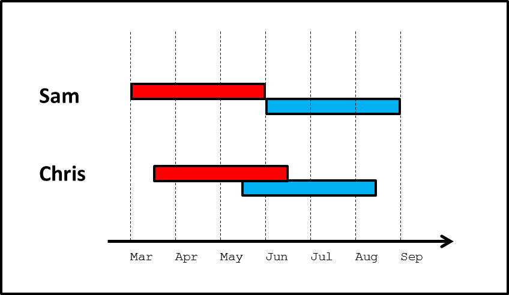
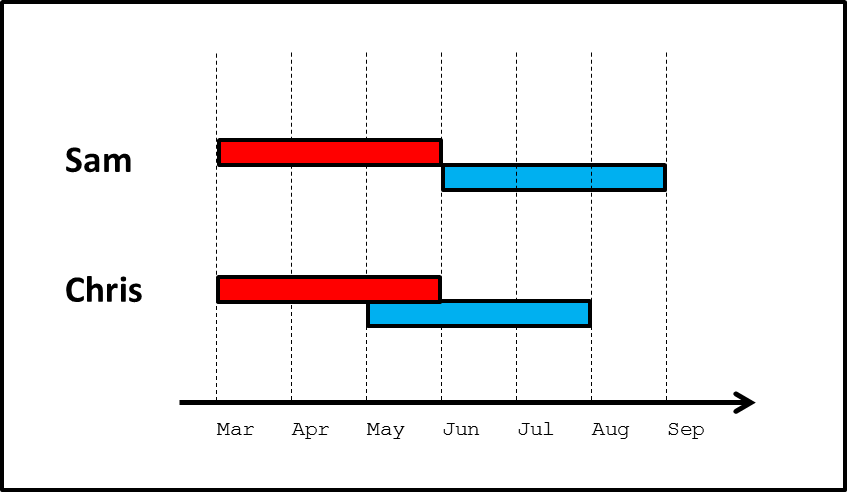
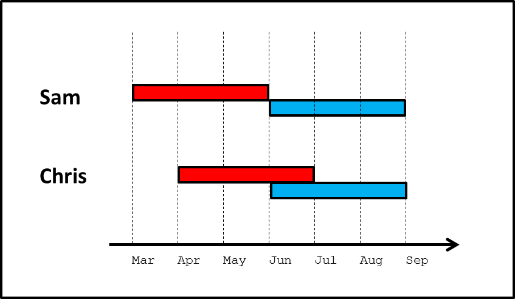
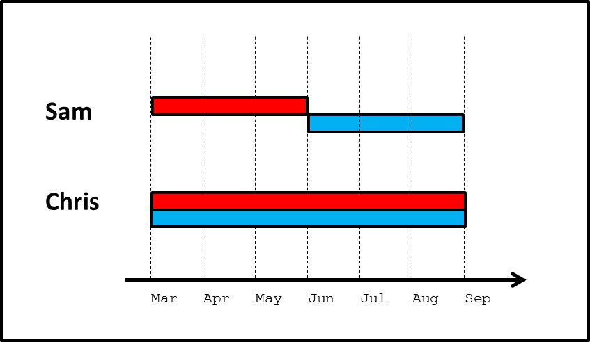
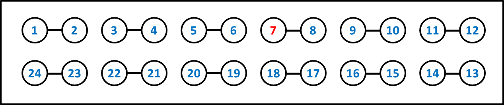
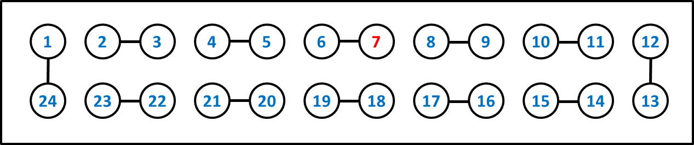
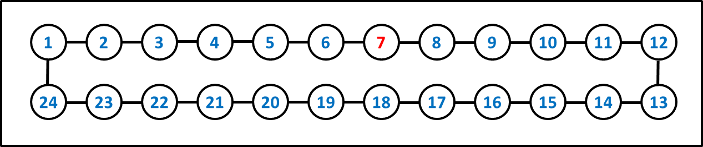
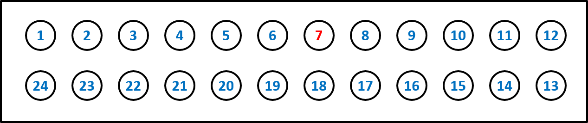
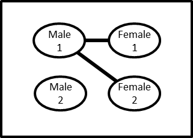

```{r setup, include=FALSE}
knitr::opts_chunk$set(echo = FALSE)
```

```{r pkgs, echo=FALSE, message=FALSE, include=TRUE}
# remotes::install_github("rlesur/klippy")
klippy::klippy('')
library(dplyr)
library(kableExtra)
```

<style>
div.blue { background-color:#e6f0ff; border-radius: 5px; padding: 20px;}
</style>

<style>
div.green { background-color:#C4F5E2; border-radius: 5px; padding: 20px;}
</style>


```{r, include=FALSE, eval=FALSE}
# Just in case we needed blue or green boxes
<div class = "green">

- This is my first conclusion
- This is my second conclusion

</div>
```

# Welcome 

The concept of concurrent partnerships appears frequently in the literature on HIV epidemiology, and is believed by some researchers to represent a key factor in understanding large disparities in the prevalence of HIV or other sexually transmitted infections (STIs) among populations.  On the one hand, the basic logic behind the hypothesis is straightforward; on the other hand, it entails some subtleties that can run counter to many people’s intuition. Thus, it can be somewhat tricky to understand, which has caused some confusion among both researchers and the general public.

The aim of this tutorial is to provide intuitive, easy-to-use tools to help researchers and the general public to understand the concept of concurrent partnerships and the ways in which it can affect the spread of sexually transmitted infections like HIV. The site contains some introductory overviews, followed by a series of four exercises.  

The four exercises focus on concurrent partnerships at the micro level and the population level; each level is first explored through a conceptual exercise, and then by a more complex numerical exercise.

The conceptual exercises do not require any special mathematical background, and are geared at providing a basic but powerful understanding of concurrent partnerships. Some readers may wish to explore only the conceptual exercises.  The numerical exercises require some additional background. Specifically, [Exercise 3](#exercise3) requires an ability to calculate basic probabilities. [Exercise 4](#exercise4) requires familiarity with the R programming language. We thus provide a tutorial for each of these components. Readers may wish to try the exercises first, to see if they are able to follow them; if not, they can switch over to the tutorials.

Throughout the exercises, we will use the term “concurrency” as short-hand for “concurrent partnerships” or “sexual relationship concurrency.”  One may see all of these terms in the literature; they mean the same thing.

> Readers may also find it useful to explore how concurrency works by running the related Shiny application.  That app is hosted online at [ConcurrencySim](https://statnet.shinyapps.io/ConcurrencySim/), or the package can be installed and the Shiny app run locally from our [GitHub concurrency.sim repository](https://github.com/statnet/concurrency.sim)

# Overview of Key Concepts

## What concurrency is (and is not)

**Concurrent partnerships** refers to the situation in which one individual is involved in **two or more relationships that overlap in time**.  

Concurrency is **not** simply a synonym for multiple partnerships. 

The phrase “multiple partnerships” is typically used in HIV/STI epidemiology to refer the case of people having multiple sex partners over the course of some time period—for example, a year. Within this definition, each pair of multiple partners can be sequential (one ends before the next one begins; also called serial monogamy), or they can be concurrent.  

> In order for someone to have concurrent partnerships, they must have multiple partnerships (at least two); but the reverse is not necessarily true—one can have multiple partners without having concurrent partners.

In the following examples, let the red line represent the time that person A is in a sexual relationship with person B, and the blue line represent the time that person A is in a sexual relationship with person C. All three cases represent Person A having multiple (specifically two) partners.  But only in the latter two cases does Person A have concurrent partners.  Sometimes researchers distinguish between these two forms of concurrency by referring to them as “transitional concurrency” and “embedded concurrency”.

```{r, echo=FALSE, out.width="500px"}
knitr::include_graphics("concurrency.png")
```

Having multiple sexual partners will typically increase the potential for a person to acquire or transmit an STI, when compared to the same person having just one partner.  This is true regardless of whether those multiple partners are sequential or concurrent.  But **the importance of concurrent partnerships is that they greatly increase the potential for an STI to spread, above and beyond multiple partnerships that are sequential**.  As we progress through the exercises on this website, we will explore how and why this is, and what the implications are.

## How concurrency works (and does not)

Probably the most important—and most misunderstood—aspect of concurrency is the question of who it puts at risk.  Most people are used to thinking about risk of disease for individuals, due to individual risk factors.  For example, we often think about how someone having a particular gene or eating a particular diet will increase that person’s risk of developing diabetes.  For infectious diseases, we do the same:  does attending day care affect a child’s risk of acquiring the flu? Does condom use affect one’s risk of acquiring an STI?

The tricky thing about concurrency is that it doesn’t work the way we are used to thinking.  For instance, if a man has two partners concurrently, then he will have the exact same risk of acquiring an STI as if he had had those same two partners sequentially, all else being equal.  But he will have a higher chance of passing the infection on to one of his partners.  

> The person put at risk by concurrency is not the person who has concurrent partners, but instead the partners of this person. 

The exercises that follow will demonstrate how and why concurrency works this way, and what the implications are.

One important thing we can already see is that this feature of concurrency thus makes it difficult to actually detect concurrency at work in spreading STIs.  Most disease studies look at individual factors (behaviors, genes, etc.) as predictors of individual risk, for at least two reasons: (1) this matches how we are used to thinking about risk (see above); and (2) this is a relatively familiar and feasible way of designing a study of disease. But this approach will not allow us to detect the impact of concurrency. 

One can measure the prevalence of concurrency at the individual level, by collecting data on the sequence and timing of people’s sexual relationships.  But the effect of concurrency on STI transmission can not be examined by comparing persons with concurrent partners to those without concurrent partners (controlling for cumulative number of partners over time), because the additional risk is to the partners. 

> Finding no correlation between a person's concurrency and their STI status  does not mean that concurrency is not increasing the spread of STIs; it simply means that one is looking for the effect in the wrong person. 

The exercises on this website explain why this is so.

## What this tutorial is (and is not)

The body of literature on concurrency is large, and our goal is not to summarize all of it (although we do provide links to some of it in the [ConcurrencyResources More Resources] section). That literature has two major research paradigms within it: 

* using mathematical models to demonstrate the potential impact of concurrency

* analyzing data to show that two or more populations that differ in prevalence or patterns of STIs also have corresponding differences in prevalence or patterns of concurrency

Some papers do both of these things together.  The methods to support each of these paradigms have developed over the years, starting off fairly simple and becoming more complex.  This website _does not_ address the data side of the research at all.  And it _does not_ aim to reproduce all of the complexity of all of the concurrency models that have been built.  

What this tutorial _does do_ is to explore the basic logic of concurrency to help readers who are not familiar with the modeling work to gain some intuition about concurrency and its impacts.  In order to make models realistic, they must become complex; and once they become complex, it is difficult for most people to understand them and follow their logic.  

> This tutorial makes things simple, to provide an accessible introduction to how concurrency works and what its potential effects are.  

Aided by the resulting insights, those who are interested can then explore the literature further.

By the end, then, readers should:

* be able to highlight the mechanisms by which concurrency does (and does not) work
* explain how concurrency can impact epidemic dynamics 
* be able to read the concurrency literature more critically, and to assess whether study designs and analysis methods are appropriate for detecting concurrency effects.


# Exercises 

## Micro level intuition {#exercise1}

### Introduction

In this exercise, we will focus on two people. Let’s call them Sam and Chris.  Each of them had two sex partners in the last six months.  And each of those partnerships lasted for three months.  All four partnerships had the same number and type of unprotected sex acts in them. The only difference is that Sam’s partners were sequential, while Chris’s partners were concurrent for one month. (Notice the simple mnemonic: sequential Sam, concurrent Chris)  During the entire six month period, nobody involved had any other partners.

We can picture this scenario, with each person’s first partner colored red and second partner blue, as follows:

```{r, echo=FALSE, out.width="500px"}

```

Notice all of the components that we have kept identical between the two cases: Sam and Chris each have the same number of new partners during the six-month period; they each have the same number of sex acts with each partner; their relationships each last the same length; and their sex occurs on average no earlier or later than each other (that is, both have their sex acts evenly centered around the beginning of June).

### Questions + {.tabset}

#### Questions
Now, think about each of the following questions. For each question, decide on one of four answers:  **Sam** is more likely; **Chris** is more likely; **Both** are equally likely; or perhaps there is not enough information, so you **Can't say** .

<hr>
*Scenario 1:* The blue partners are each infected with the same STI, while Sam, Chris and the red partners are uninfected.

```{r scenario1Q}

 dt <- data.frame(
  "Q" = c("1","2","3"),
  "Question" = c('Who is more likely to get infected?',
                 'Who is more likely to get infected first?',
                 'If infected, who is more likely to transmit to their red partner?'),
  "Sam" = rep('<input type="checkbox">',3),
  "Chris" = rep('<input type="checkbox">',3),
  "Both Equally" = rep('<input type="checkbox">',3),
  "Can't Say" = rep('<input type="checkbox">',3)
  )
  
dt %>% 
  kable(align = 'llcccc', escape=F) %>%
  kable_styling() %>%
  column_spec(1:6, border_left = T, border_right = T) %>%
  column_spec(3:6, width_min = "5em", width_max="5em") %>%
  row_spec(3, extra_css = "border-bottom: solid lightgray")
```

<hr>
*Scenario 2:* The red partners are each infected with the same STI, while Sam, Chris and the blue partners are uninfected.

```{r scenario2Q}

 dt <- data.frame(
  "Q" = c("1","2","3","4"),
  "Question" = c('Who is more likely to get infected?',
                 'Who is more likely to get infected first?',
                 'If infected, who is more likely to transmit to their blue partner?',
                 'If infected, who is likely to transmit more quickly to their blue partner?'),
  "Sam" = rep('<input type="checkbox">',4),
  "Chris" = rep('<input type="checkbox">',4),
  "Both Equally" = rep('<input type="checkbox">',4),
  "Can't Say" = rep('<input type="checkbox">',4)
  )
  
dt %>% 
  kable(align = 'llcccc', escape=F) %>%
  kable_styling() %>%
  column_spec(1:6, border_left = T, border_right = T) %>%
  column_spec(3:6, width_min = "5em", width_max="5em") %>%
  row_spec(4, extra_css = "border-bottom: solid lightgray")

```


#### Answers

*Scenario 1:* The blue partners are each infected with the same STI, while Sam, Chris and the red partners are uninfected.

```{r scenario1A}

 dt <- data.frame(
  "Q" = c("1","2","3"),
  "Question" = c('Who is more likely to get infected?',
                 'Who is more likely to get infected first?',
                 'If infected, who is more likely to transmit to their red partner?'),
  "Sam" = rep('<input type="checkbox">',3),
  "Chris" = c('<input type="checkbox"', rep('<input type="checkbox" checked>',2)),
  "Both Equally" = c('<input type="checkbox" checked>', rep('<input type="checkbox">',2)),
  "Can't Say" = rep('<input type="checkbox">',3)
  )
  
dt %>% 
  kable(align = 'llcccc', escape=F) %>%
  kable_styling() %>%
  column_spec(1:6, border_left = T, border_right = T) %>%
  column_spec(3:6, width_min = "5em", width_max="5em") %>%
  row_spec(3, extra_css = "border-bottom: solid lightgray")

 
```

**Question 1**: Who is more likely to get infected—Sam or Chris? 
**Both are equally likely**. Sam and Chris can each be infected by their blue partner only.  And they each have the same amount and type of exposure (sex acts) with them.

**Question 2**: If Sam and Chris do get infected, who is likely to be infected first?
**Chris**. Chris's window of exposure to the blue partner occurs earlier than Sam's, even though overall (across both partners) Chris does not have sex any earlier than Sam does on average.   We will call this effect “**accelerated acquisition.**”

**Question 3**: If Sam and Chris do get infected, who is more likely to transmit to their red partner? 
**Chris**. In fact, Sam has zero probability of transmitting to the red partner. Chris is capable of doing so; we don’t know the exact probability, but it is presumably greater than 0.
Let us call this phenomenon “**backwards transmission**.” The word “backwards” refers to the fact that because Chris has concurrent partners, an infection can be transmitted from the second partner Chris acquired (blue) **back** to the first partner Chris acquired (red).

<hr>
*Scenario 2:* The red partners are each infected with the same STI, while Sam, Chris and the blue partners are uninfected.

```{r scenario2A}

 dt <- data.frame(
  "Q" = c("1","2","3","4"),
  "Question" = c('Who is more likely to get infected?',
                 'Who is more likely to get infected first?',
                 'If infected, who is more likely to transmit to their blue partner?',
                 'If infected, who is likely to transmit more quickly to their blue partner?'),
  "Sam" = c('<input type="checkbox">', '<input type="checkbox" checked>',
            rep('<input type="checkbox">',2)),
  "Chris" = c(rep('<input type="checkbox">',3), '<input type="checkbox" checked>'),
  "Both Equally" = c('<input type="checkbox" checked>',rep('<input type="checkbox">',3)),
  "Can't Say" = c(rep('<input type="checkbox">',2), '<input type="checkbox" checked>',
                  '<input type="checkbox">')
  )
  
dt %>% 
  kable(align = 'llcccc', escape=F) %>%
  kable_styling() %>%
  column_spec(1:6, border_left = T, border_right = T) %>%
  column_spec(3:6, width_min = "5em", width_max="5em") %>%
  row_spec(4, extra_css = "border-bottom: solid lightgray")


```

**Question 1**: Who is more likely to get infected—Sam or Chris? 
**Both are equally likely**. Sam and Chris can each be infected by their red partner only.  And they each have the same amount and type of exposure (sex acts) with them.

**Question 2:** If Sam and Chris do get infected, who is likely to do so sooner?
**Sam**. Sam's window of exposure to the red partner occurs earlier than Chris's, even though overall (across both partners) Sam does not have sex any earlier than Chris does on average. However, the implications of this depend on the answer to the next question....

**Question 3**: If Sam and Chris do get infected, who is more likely to transmit to their blue partner? 
**Can't say**.  This one is the most tricky; the answer depends on a number of pieces, including the overall level of transmissibility of the infection in question; whether or not that level varies over time; and the frequency of sex acts within each relationship. Clearly, both Sam and Chris are capable of infecting their blue partner. Beyond that, there are two different possible effects that work in opposite directions:

_Favoring transmission by Chris_: Some STIs can be cleared by the body naturally, or as result of treatment.  Examples include gonorrhea and chlamydia.  Other STIs, like HIV, cannot be cured, but have a short period early in infection during which an individual is highly infectious to others.  For HIV, this period lasts perhaps 2-3 months, and an individual may be 10 to 40 times more infectious than they are subsequently.  (See Hollingsworth et al. 2008, Abu Raddad and Longini 2008, and Pinkerton 2008 for these estimates).  In these contexts, Chris may be more likely to infect the blue partner than Sam is, since Chris is more likely to be having sex with the blue partner during the time shortly after being infected by red, while still infected (for curable STIs) or highly infectious (for HIV). For example, if Sam and Chris are each infected by their red partner at the beginning of those partnerships, three months will pass before Sam has sex with blue for the first time, but only two months will pass for Chris.  If they are each infected one month into their relationships with red, then two months will pass for Sam before initiating sex with blue, and only one month for Chris.  And so on.  In each case, Sam is more likely to have been cured of the disease, or to have moved out of the period of high infectiousness before being with blue. Let us call this effect “**acute infectivity**”.  We will use the term to refer to all cases in which infectiousness goes down with time, whether to 0 or to some positive value, and whether through cure or through treatment or through the natural history of the infection.  Note that the likelihood of Sam and Chris getting infected early or late in their relationship with the red partner—which determines the importance of the acute infectivity effect—is a function of overall infectiousness per act and number of acts per relationship.

_Favoring transmission by Sam_: If Chris is infected towards the tail end of the relationship with red, then some of the sex acts that Chris has with blue may have already happened.  Thus, some of Chris’s opportunities to infect blue will be missed, and the probability of transmitting to blue will decline. Sam does not face this; no matter when Sam is infected by red, it is always before the start of any sex acts with blue.  We will call this “**reduced forward transmission**.” Note that, as with acute infectivity, the likelihood of Sam and Chris getting infected early or late in their relationship with the red partner—which determines the importance of the reduced forward transmission effect—is a function of overall infectiousness per act and number of acts per relationship.

So, the answer to this question may be Sam, or it may be Chris, depending on the exact nature of the infectiousness of the STI of interest over time, and the number of sex acts. We will return to this point in detail on the next page, and explore it mathematically in later exercises.

**Question 4:** If Sam and Chris do infect their blue partner, who is likely to do so sooner in time? Sooner after getting infected themselves? 
**Chris**, on both counts.  For the first half of the question, we simply note that the blue partner's exposure period to Chris occurs earlier in time than their exposure period to Sam. For the second half of the question, we use the same basic logic as in the description of acute infectivity above (under Scenario 2, Question 2). If Sam and Chris are each infected at the beginning of their relationships with red, the range over which Sam might infect blue is 3-6 months later, but for Chris, it’s 2-5 months later.  If Sam and Chris are each infected during their second month with red, the range over which Sam might infect blue is 2-5 months later, but for Chris, it’s 1-4 months later.  And so on.  Although the logic is roughly the same as for the “acute infectivity” process, the implication here is slightly different.  There, we were focused on the fact that Chris would be more likely to be highly infectious when encountering blue than Sam would.  But here we see that even in the absence of any mechanism that causes greater infectivity during a short period after infection, with concurrency an STI can “hop” along chains of three people (from person A to B to C) on average more quickly than it could when people are practicing sequentially monogamous relationships of the same length. We will call this phenomenon “**path acceleration.**”  So despite the fact that Sam was probably infected earlier than Chris was (as we saw in the answer to the previous question), the disease ends up moving further along to another member of the population sooner via Chris.  This is because sequential monogamy causes the infection to remain "locked" in the partnership between Sam and the red partner until that relationship ends; this does not happen with Chris and the red partner because of concurrency.

#### Discussion

We have explored an example in which Sam and Chris each have the same number of new partners during the six-month period; they each have the same number of sex acts with each partner; their relationships each last the same length; and their sex acts occur on average no earlier or later than each other's (that is, both have their sex acts evenly centered around the same time point). Below, and in later exercises, you will have the opportunity to consider other models.  But, for now, **what do the answers we saw on the previous page tell us about the effects of concurrency in this scenario? A few very important things:**

Sam and Chris had the exact same risk of getting infected from their red partner. They also had the exact same risk of getting infected from their blue partner. Thus, Sam and Chris had the exact same risk of getting infected overall.

>INSIGHT 1: All else being equal, whether one’s partnerships are sequential or concurrent makes no difference whatsoever to one’s risk of acquiring an STI.

On the other hand, if they do get infected, there are three different processes that affect how likely they are to transmit to someone else.  Two of these increase Chris’s probability of transmitting relative to Sam’s, and one increases Sam’s relative to Chris’s.  These are:

* The “backwards transmission” effect: increases Chris’s probability of transmitting relative to Sam’s.
* The “acute infectivity” effect: increases Chris’s probability of transmitting relative to Sam’s.
* The “reduced forward transmission” effect: increases Sam’s probability of transmitting relative to Chris’s.

In terms of backwards transmission, the distinction between concurrency and sequential monogamy is absolute: concurrency generates backwards transmission, and sequential monogamy does not.

In terms of forward transmission: there are two different effects, which work in opposite directions, so the picture is less consistent. Since we are only exploring conceptually right now, we cannot be much more precise than this. However, now that we have identified the three effects, we can also provide some foreshadowing to [Exercise 3](#exercise3), which explores the same effects more mathematically.  In the range of scenarios we consider there, we will see that the effect of backwards transmission always outweighs that of missed forward transmission. That is, when one combines their two effects, Chris is always more likely to transmit than Sam, although the exact difference depends on the details. More generally, the broader literature on concurrency shows that across ranges of realistic diseases and relational dynamics, the collective effect of these various pathways strongly favors transmission by those with concurrent partners over sequential.

>INSIGHT 2. All else being equal, whether one’s partnerships are sequential or concurrent has three effects on one’s probability of transmitting an STI.  The collective effect of these generally favors transmission by the person with concurrent partners, and sometimes by a very large amount, depending on the level of infectiousness and its change over time.

Both Sam and Chris can acquire from red and transmit to blue.  But even here, in Chris’s case the STI is capable of spreading more quickly through this path than in Sam’s case.  In Sam’s case, the STI must lose time being “locked” in the monogamous partnership, waiting for it to end and for the next one to begin; the infection does not need to experience the same waiting period with Chris. If the blue partner did have other partners, then the infection would be able to proceed further on through the network more quickly.

>INSIGHT 3: Sequential partnerships lead to STIs spending some amount of time being “locked” in a partnership; concurrent partnerships allow it to move along a chain of three people (and then perhaps on from there) more quickly.

In [Exercise 1](#exercise1), and in the insights that resulted from it, we were largely focused on the question of concurrency’s effect at the micro level, specifically among an individual and two of their (sequential or concurrent) partners. In reality, of course, these three people are embedded in much larger social networks, something we began to hint at with Insight 3. Any of the three may have additional partners, either concurrently or subsequently; those partners will have other partners, and so on. Differences at the micro level have the potential to aggregate up to the population level in different ways. So now that we have some insight into how concurrency affects transmission locally, let us consider in [Exercise 2](#exercise2) how much this can matter to the population as a whole.

Note that we made some assumptions about Chris's and Sam's sexual partnerships at the outset in order to make them as comparable as possible, while allowing one to have concurrency and the other not.  But, the approach we took is not the only one possible, nor the only one worth exploring.  Those who wish to consider this in more depth may choose to do so in the [Follow-Up](#exercise1fu).  Other may wish to proceed to [Exercise 2](#exercise2).

#### Follow-up {#exercise1fu}

In [Exercise 1](#exercise1), we set up the example so that Sam and Chris were similar on as many important metrics as possible, while still allowing Chris to have concurrent relationships, and Sam to have sequential relationships.  Recall the example:

```{r, echo=FALSE, out.width="500px"}

```

Items that were held equal across Sam and Chris include:

-	Sam and Chris each have the same number of new relationships over the 6-month period
-	Sam and Chris each have relationships of the same length
-	Sam and Chris each have the same frequency of coital acts with their partners
-	Sam and Chris each have sex at the same time on average—both are arranged symmetrically around the beginning of June.

However, some things needed to be different.  Obviously, we wanted one to have concurrent partners and the other not, by design.  But doing that requires some other aspects to differ as well. In our example, these included:

-	Chris began having sex later than Sam
-	Chris stopped having sex earlier than Sam
-	Chris had time periods with more sex than Sam, and other time periods with no sex at all. On the other hand, Sam had a constant coital frequency across the six months.

Mathematically, one cannot have everything on both lists above match up between Sam and Chris when Chris is having concurrent partners and Sam is not.  Something else must differ.  We chose the above configuration because we felt that it most matched people’s intuition for a fair comparison that allows one to isolate the effect of concurrency as much as possible.  But one might chose other comparisons as well.  Below we include three examples that we encourage readers to explore on their own, identifying what is similar and what is different between Sam and Chris, and how each of the questions in [Exercise 1](#exercise1) about probabilities and timings of transmission would be answered for that scenario.  Readers should also consider defining and exploring scenarios of their own, remembering, of course, to be mindful that all insights derived must be interpreted in light of the similarities and differences between Sam and Chris for that scenario.

<hr>
*Alternate Scenario 1.* Sam and Chris initiate sex at the same time, and Chris's sexual acts occur earlier than Sam's on average.

```{r, echo=FALSE, out.width="500px"}
# 400px?

```

<hr>
*Alternate Scenario 2.* Sam and Chris complete sex at the same time, and Chris's sexual acts occur later than Sam's on average.

```{r, echo=FALSE, out.width="500px"}
# 400px?

```

<hr>
*Alternate Scenario 3.* Sam and Chris begin and complete sex at the same time; Chris's relationships are twice as long as Sam's, but _Chris has only half as many coital acts with each partner as Sam does_.  Thus, overall Sam and Chris have the same total frequency of sex.

This scenario is an example of **coital dilution**, wherein Chris has only half as many sex acts per unit time within each relationship as Sam does.

```{r, echo=FALSE, out.width="500px"}
# 400px?

```

Note that across all scenarios, one of the things on which we maintain consistency is the total number of coital acts had by Sam and Chris.  Reducing one relative to the other makes it impossible  to identify the effect of concurrency itself, since a reduction in sex will in and of itself have a major impact on disease transmission.


## Population level intuition {#exercise2}

### Introduction

Now imagine a whole group of people – let’s say there are 24 of them.  And exactly 1 of them is infected with an STI – Person 7.  We will color Person 7 red, and everyone else blue.  And we will consider two scenarios, and two questions with each scenario.

<hr>
*Scenario 1:* In this scenario, everyone begins with 1 partner, with whom they stay sexually active for 3 months.
```{r, echo=FALSE, out.width="500px"}

```

After that time, they all end their existing partnerships, and start a new 3-month relationship, as follows:

```{r, echo=FALSE, out.width="500px"}

```

<hr>
*Scenario 2:* In this scenario, everyone has two partnerships concurrently, in a single giant circle, which they maintain for 3 months.

```{r, echo=FALSE, out.width="500px"}

```
 

After this, everyone spends the next 3 months with no partners at all.

```{r, echo=FALSE, out.width="500px"}

```

### Questions + {.tabset}

#### Questions

**Question 1**. Over time, how many partners did each person have in Scenario 1?

**Question 2**. Over time, how many partners did each person have in Scenario 2?

**Question 3**. Over time, how many people (including Person 7) could possibly get infected in Scenario 1?

**Question 4**. Over time, how many people (including Person 7) could possibly get infected in Scenario 2?

#### Answers

**Question 1**. Over time, how many partners did each person have in Scenario 1? Answer: **2**. Every single person in the population has two partners, and they all have them sequentially. 

**Question 2**. Over time, how many partners did each person have in Scenario 2?  Answer: **2**. Every single person in the population has two partners, and they all have them concurrently.

**Question 3**. Over time, how many people (including Person 7) could possibly get infected in Scenario 1?   Answer: **4**. Person 7 could infect person 8 during the first three months. Then, during the next three months, 7 could infect 6, and 8 could infect 9.  But that is as far as the infection can go.

**Question 4** Over time, how many people (including Person 7) could possibly get infected in Scenario 2? Answer: **24**.  The infection could travel the whole way around the circle, without stopping.

That means that 6 times more people are at risk in the second scenario than in the first one.  And in both scenarios, everyone had exactly two partners.  The only difference is that in the first scenario the partnerships are sequential, and in the second one they are concurrent.

Notice that this magnitude can change: no matter how large the population gets, in the first scenario there are always four people at risk, and in the second scenario, the entire population is at risk, whether that’s 24 people, or 100, or 1000. The only thing limiting the spread of disease to the whole population in the concurrency case is the fact that most diseases have relatively low probability of transmissions per contact.  So in practice, an infection is unlikely to go all the way around a circle of 100 or 1000 people in the time span of six months. But it will almost certainly infect more people (and possibly many more) than in the sequential monogamy case.

Remember, of course, that these scenarios are not meant to be realistic—in no population does everybody have exactly two partnerships, whether sequential or concurrent, or change partners at exactly the same time. But this exercise does make clear how powerful concurrency can be in facilitating rapid and large-scale diffusion of an STI in a population, in ways that sequential monogamy typically does not.


#### Discussion

Through two conceptual exercises, we learned that:

**Concurrency does not increase risk to the individual practicing concurrency, relative to the same partners sequentially**

This means that, even if a real concurrency effect exists, it cannot be detected by analyses that use an individual’s concurrency practices as a predictor of their own infection status (controlling for their cumulative number of partners over time).  If this kind of analysis does show an effect, there are different possible explanations – for instance:

* that people with concurrent partners are more likely to have partners who also have concurrent partners
* that people with concurrent partners are more likely to choose partners who are infected
* that people with concurrent partners tend to have riskier sex in some way not accounted for

Any of these may be true.  However, none of them must be true in order for concurrency to amplify STI spread in a population.

**Concurrency acts in three different ways at the micro level to amplify disease transmission**

These include increasing numbers of transmission paths, speeding up existing transmission paths, and increasing exposure during periods of relatively high infectiousness.
	
**These local effects can accumulate up to produce very large differences in epidemic potential at the population level**

We saw this with [Exercise 2](#exercise2), where the population with concurrency had 6 times more possible infections than the population without.
For those who wish to see more rigorous examples of these same patterns, we now proceed to the Numerical Exercises.


## Micro level math {#exercise3} 

### Introduction

We shall now revisit Sequential Sam and Concurrent Chris. This time, we will assume that the probability of transmission from a single act of sex between an infected and an uninfected person is 1%. There is no acute infection, nor any cure.  Thus, in this exercise, we are not considering the impact of concurrency via the “acute infectivity” effect, only through other mechanisms.

For those readers who would like a refresher on the relevant rules of probability, visit our [Probability Tutorial](#tut2).

### Questions + {.tabset}

#### Questions

Let us imagine that Sam has sex 200 times: first 100 times with the red partner, and then 100 times with the blue partner. This can be depicted as:

```{r, echo=FALSE, out.width="800px"}

```

**Question 1**: If the red partner is infected and the blue is not, what is the probability that Sam gets infected from the red partner?

**Question 2**: If the blue partner is infected and the red is not, what is the probability that Sam gets infected from the blue partner?

**Question 3**: If we assume that exactly one of Sam’s partners is infected, and it is equally likely to be the red partner or the blue partner, what is Sam’s probability of becoming infected?

**Question 4**: If the red partner is infected and the blue is not, what is the probability that Sam gets infected AND transmits to the blue partner?

**Question 5**: If the blue partner is infected and the red is not, what is the probability that Sam gets infected AND transmits to the red partner?

**Question 6**: If we assume that exactly one of Sam’s partners is infected, and it is equally likely to be the red partner or the blue partner, what is the probability that Sam both becomes infected and transmits to an uninfected partner?

Now let us imagine that Chris has sex 200 times: once with the red partner, then once with the blue partner, then once with red, then blue, and back and forth 100 times for a total of 200 sex acts.

```{r, echo=FALSE, out.width="800px"}

```

**Question 7**: If the red partner is infected and the blue is not, what is the probability that Chris gets infected from the red partner?

**Question 8**: If the blue partner is infected and the red is not, what is the probability that Chris gets infected from the blue partner?

**Question 9**: If we assume that exactly one of Chris’s partners is infected, and it is equally likely to be the red partner or the blue partner, what is Chris’s probability of becoming infected?

**Question 10**: If the red partner is infected and the blue is not, what is the probability that Chris gets infected AND transmits to the blue partner? (This one is hard—if you need a hint, click the Hint tab.)

**Question 11**: If the blue partner is infected and the red is not, what is the probability that Chris gets infected AND transmits to the red partner? (This one is hard—if you need a hint, click the Hint tab.)

**Question 12**: If we assume that exactly one of Chris’s partners is infected, and it is equally likely to be the red partner or the blue partner, what is the probability that Chris both becomes infected and transmits to an uninfected partner?

Now let’s compare Sam and Chris.

**Question 13**:  What is the difference between Sam’s chance of becoming infected and Chris’s chance of becoming infected?

**Question 14**:  What is the difference between Sam’s chance of transmitting and Chris’s chance of transmitting? 

#### Hints

Need help on either of these two questions?

**Question 10**: If the red partner is infected and the blue is not, what is the probability that Chris gets infected AND transmits to the blue partner?

**Question 11**: If the blue partner is infected and the red is not, what is the probability that Chris gets infected AND transmits to the red partner?

Our first piece of guidance is to work through the _Probability Tutorial_ (see link on left), if you have not already.  The example at the bottom of that page provides some hints as to how to proceed with the above.

Then, with that tutorial in mind, consider the following steps in order.
  
* What set of conditional probabilities does one need to calculate in order to get the final answer?

* As examples, try calculating a few of these conditional probabilities.  Say, the 1st, 2nd, and 37th.

* Now, develop a general expression for the nth of these conditional probabilities.

* Now, given the rules of probability, and the relationship among the probabilities you have just calculated, how does one combine them together to get the joint probability?

If you would like some more hints, see the next tab!

#### More Hints

**For Question 10:** There are 100 mutually exclusive ways that Chris can get infected by red and pass it on to blue:

1. Chris is infected on the first sex act with red, and then subsequently passes to blue; 

2. Chris is infected on the second sex act with red, and then subsequently passes to blue; 

3. Chris is infected on the third sex act with red, and then subsequently passes to blue; etc. 
 
Try the following:

* Calculate the probability for the first of these (Chris is infected on the first sex act with red, and then subsequently passes to blue). Note that this probability can be broken down further into two pieces:

_P(Chris is infected on the first sex act with red) * P(Chris infects blue | Chris is infected on the first sex act with red)_

* Calculate the probability for the second of these (Chris is infected on the second sex act with red, and then subsequently passes to blue). Note that this probability can be broken down further into two pieces:

_P(Chris is infected on the second sex act with red) * P(Chris infects blue | Chris is infected on the second sex act with red)_

* Since Chris must avoid infection on the first sex act with red in order to become infected on the second sex act with red, this can be further broken down into:

_P(Chris is infected on the second sex act with red | Chris avoided infection on the first sex act with red) * P(Chris avoids infection on the first sex act with red) P(infects blue | Chris is infected on the second sex act with red)_

* Calculate the probability for the 37th of these (Chris is infected on the 37th sex act with red, and then subsequently passes to blue).

* Looking at these three expressions, try developing an expression for the probability that Chris is infected on the nth sex act with red, and then subsequently passes to blue

* Use a software package with which you are familiar (Excel, R, etc.) to calculate all 100 values

* Since the events are mutually exclusive, use the basic rules of probability to determine the probability that any one of these 100 events can happen.

The structure of the solution for Question 11 is exactly the same, although the resulting expression differs slightly.  

#### Answers

On this page, we provide the numerical answers only. For those readers who wish to see derivations of them, see the Derivations tab.  Or for those readers who had some incorrect answers and want to try again, check out the [Probability Tutorial](#tut2).

**The probability of transmission from a single act of sex between an infected and an uninfected person is 1%.**

**Let us imagine that Sam has sex 200 times: 100 times with the red partner, and then 100 times with the blue partner.**

**Question 1**: If the red partner is infected and the blue is not, what is the probability that Sam gets infected from the red partner? **63.4%**

**Question 2**: If the blue partner is infected and the red is not, what is the probability that Sam gets infected from the blue partner? **63.4%**

**Question 3**: If we assume that exactly one of Sam’s partners is infected, and it is equally likely to be the red partner or the blue partner, what is Sam’s probability of becoming infected? **63.4%**

**Question 4**: If the red partner is infected and the blue is not, what is the probability that Sam will get infected AND pass the infection on to the blue partner? **40.2%**

**Question 5**: If the blue partner is infected and the red is not, what is the probability that Sam will get infected AND pass the infection on to the red partner? **0%**

**Question 6**: If we assume that exactly one of Sam’s partners is infected, and it is equally likely to be the red partner or the blue partner, what is Sam’s overall joint probability of becoming infected and transmitting? **20.1%**

<br>

**Now let us imagine that Chris has sex 200 times: once with the red partner, then once with the blue partner, then once with red, then blue, and back and forth 100 times for a total of 200 sex acts.**

**Question 7**: If the red partner is infected and the blue is not, what is the probability that Chris gets infected from the red partner? **63.4%**

**Question 8**: If the blue partner is infected and the red is not, what is the probability that Chris gets infected from the blue partner? **63.4%**

Same logic as Question 2.

**Question 9**: If we assume that exactly one of Chris’s partners is infected, and it is equally likely to be the red partner or the blue partner, what is Chris overall probability of becoming infected? **63.4%**

**Question 10**: If the red partner is infected and the blue is not, what is the probability that Chris will get infected AND pass the infection on to the blue partner? **26.8%**

**Question 11**: If the blue partner is infected and the red is not, what is the probability that Chris will get infected AND pass the infection on to the red partner? (This one is hard—do your best!) **26.4%**

**Question 12**: If we assume that exactly one of Chris’s partners is infected, and it is equally likely to be the red partner or the blue partner, what is Chris overall joint probability of becoming infected and transmitting? **26.6%**

<br>
**Now let’s compare Sam and Chris.**

**Question 13**:  What is the difference between Sam’s chance of becoming infected and Chris’s chance of becoming infected?  **Nothing** – Sam and Chris have the exact same chance of becoming infected.

A comparison of the answers to Questions 3 and 9.

**Question 14**:  What is the difference between Sam’s chance of transmitting and Chris’s chance of transmitting?  **Chris’s probability of transmitting is 1.3 times that of Sam’s (26.6% vs. 20.1%).**

#### Derivations

**The probability of transmission from a single act of sex between an infected and an uninfected person is 1%.**

**Let us imagine that Sam has sex 200 times: 100 times with the red partner, and then 100 times with the blue partner.**

**Question 1**: If the red partner is infected and the blue is not, what is the probability that Sam gets infected from the red partner? **63.4%**

The probability that Sam will avoid infection at each sex act is 1- 0.01 = 0.99.  The probability that Sam will avoid it through 100 consecutive sex acts is 0.99 x 0.99 x 0.99…. = 0.99^100^. The probability that Sam will become infected during any of 100 consecutive sex acts is 1 – probably of avoiding infection = 1 -0.99^100^ = 0.634.

If this logic is unfamiliar, please see the [Probability Tutorial](#tut1), where we lay it out in more detail.

**Question 2**: If the blue partner is infected and the red is not, what is the probability that Sam gets infected from the blue partner? **63.4%**

The calculations here are the same as for Question 1. Sam has the same number of contacts with red as with blue, and the same probability of transmission per act in each case.

**Question 3**: If we assume that exactly one of Sam’s partners is infected, and it is equally likely to be the red partner or the blue partner, what is Sam’s probability of becoming infected? **63.4%**

There are two equally likely, mutually exclusive, possibilities: red is infected, or blue is infected. Given our stated assumptions, one must be true, so their probabilities sum to 1.  If they are equally likely and their probabilities sum to 1, they must each have a probability of ½.

There are two mutually exclusive ways that Sam can become infected: by red, or by blue.  His total probability of becoming infected is:

_P(Sam is infected by red) + P(Sam is infected by blue)_

In order to be infected by someone, it is necessary for them to be infected.  So, in each case, those probabilities can be broken down further:

|    = _P(red is infected)*P(Sam is infected by red | red is infected) + P(blue is infected)*P(Sam is infected by blue | blue is infected)_

|    = (0.5)(0.634) + (0.5)(0.634) = 0.634.

| 

**Question 4**: If the red partner is infected and the blue is not, what is the probability that Sam will get infected AND pass the infection on to the blue partner? **40.2%**

We want _P(Sam is infected by red and Sam infects blue | red is infected)_

We can break this down into:

_P(Sam is infected by red | red is infected)*P(Sam infects blue | Sam is infected by red and red is infected)_

We already know that the first of these is 0.634.  For the second, the calculations are the same as in Question 1 (what is the probability that x infects y during 100 sex acts, given x is infected and y is not).

|     = (0.634)(0.634) = 0.402

|

**Question 5**: If the blue partner is infected and the red is not, what is the probability that Sam will get infected AND pass the infection on to the red partner? **0%**

Sam’s sex acts with red all preceded the first sex act with red, so there are no acts during which Sam can transmit an infection acquired for red to blue.

**Question 6**: If we assume that exactly one of Sam’s partners is infected, and it is equally likely to be the red partner or the blue partner, what is Sam’s overall joint probability of becoming infected and transmitting? **20.1%**

Following the same structure as in Question 3, we have 0.5(0.402) + 0.5(0) = 0.201.

<br>

**Now let us imagine that Chris has sex 200 times: once with the red partner, then once with the blue partner, then once with red, then blue, and back and forth 100 times for a total of 200 sex acts.**

**Question 7**: If the red partner is infected and the blue is not, what is the probability that Chris gets infected from the red partner? **63.4%**

Same logic as Question 1.

**Question 8**: If the blue partner is infected and the red is not, what is the probability that Chris gets infected from the blue partner? **63.4%**

Same logic as Question 2.

**Question 9**: If we assume that exactly one of Chris’s partners is infected, and it is equally likely to be the red partner or the blue partner, what is Chris overall probability of becoming infected? **63.4%**

Same logic as Question 3.

**Question 10**: If the red partner is infected and the blue is not, what is the probability that Chris will get infected AND pass the infection on to the blue partner? **26.8%**

There are 100 mutually exclusive ways that Chris can get infected by red and pass it on to blue: (1) Chris is infected on the first sex act with red, and then subsequently passes to blue; (2) Chris is infected on the second sex act with red, and then subsequently passes to blue; (3) Chris is infected on the third sex act with red, and then subsequently passes to blue; etc.  Since these are mutually exclusive, we can calculate the probability of each, and then add them all together.  

The probability of (1) is: P(Chris is infected on the first sex act with red) * P(infects blue | Chris is infected on the first sex act with red) = (0.01) * [1-(0.99)^100^] = 0.0634. This is because, if Chris is infected during the first sex act with red, there are still 100 acts with blue during which transmission to blue may occur.

The probability of (2) is: P(Chris is infected on the second sex act with red) * P(infects blue | Chris is infected on the second sex act with red).  In order to become infected on the second sex act with red, Chris must avoid infection on the first act, and then become infected on the second.  Then, once that happens, there are only 99 acts with blue remaining in which to transmit.  So we have (0.99) * (0.01) * [1-(0.99)^99^] = 0.0624.

If one repeats this, the general expression that emerges for the probability of Chris being infected on the n^th^ sex act with red and subsequently transmitting to blue is:

(0.99)^(n-1)^ * (0.01) * [1-(0.99)^100-(n-1)^]

The total probability is the sum of this quantity for each value of n from 1 to 100.

One can calculate each of these 100 values by hand and then add them, or use software to automate it. Below, we include a small set of R code that performs this calculation (and all the others on this page).

Once all 100 numbers are calculated and summed, the result is: 0.268. 

**Question 11**: If the blue partner is infected and the red is not, what is the probability that Chris will get infected AND pass the infection on to the red partner? (This one is hard—do your best!) **26.4%**

Here the logic is almost the same as in Question 10; there are 100 time points at which Chris may be infected by blue; however, because the sex acts with blue start later, there is one fewer acts for transmission onward to red in each of the hundred cases.  That is:

The probability of (1) is: P(Chris is infected on the first sex act with blue) * P(infects red| Chris is infected on the first sex act with blue) = (0.01) * 1-(0.99)^99^ = 0.0630

The probability of (2) is: P(Chris is infected on the second sex act with blue) * P(infects red | Chris is infected on the second sex act with blue).= (0.99) * (0.01) * 1-(0.99)^98^ = 0.0620.

The general expression for the probability of Chris being infected on the n^th^ sex act with blue and subsequently transmitting to red is:

(0.99)^(n-1)^ * (0.01) * [1-(0.99)^100-n^]

Notice the only difference from Question 10 is the final exponent. 

These hundred versions of this expression add to 0.264.

**Question 12**: If we assume that exactly one of Chris’s partners is infected, and it is equally likely to be the red partner or the blue partner, what is Chris overall joint probability of becoming infected and transmitting? **26.6%**

Following the same structure as in Questions 3 and 6, we have 0.5(0.268) + 0.5(0.264) = 0.266

<br>

**Now let’s compare Sam and Chris.**

**Question 13**:  What is the difference between Sam’s chance of becoming infected and Chris’s chance of becoming infected?  **Nothing** – Sam and Chris have the exact same chance of becoming infected.

A comparison of the answers to Questions 3 and 9.

**Question 14**:  What is the difference between Sam’s chance of transmitting and Chris’s chance of transmitting?  **Chris’s probability of transmitting is 1.3 times that of Sam’s (26.6% vs. 20.1%).**

A comparison of the answers to Questions 6 and 12.

####  R code  {#transmissioncalc}

The code below can be used to calculate transmission probabilities for Sam (sequential relationships), Chris (concurrent relationships), and the ratio of the two.

This code involves three functions: one to calculate Sam’s risk of transmitting; one for Chris’s risk of transmitting; and one to calculate the ratio.  Each function takes two arguments: the per-act probability of transmission (called beta), and the number of sex acts had with each of the two partners (called c).  There is no function to calculate Sam’s and Chris’s probability of acquisition, because these are always the same as each other. If you are not familiar with R, and wish to use these functions, you can turn to our [R tutorial](#tut2)


```{r, eval=FALSE, echo=TRUE, class.source='klippy'}
sam <- function(beta,c) {
	red.to.sam.to.blue <- (1-(1-beta)^c)^2
	blue.to.sam.to.red <- 0
	result <- red.to.sam.to.blue/2 + blue.to.sam.to.red/2
	return(result)
}

chris <- function(beta,c) {
	index <- 1:c
	red.to.chris.to.blue <- sum( (1-beta)^(index-1) * beta * (1-(1-beta)^(c-index+1)) )
	blue.to.chris.to.red <- sum( (1-beta)^(index-1) * beta * (1-(1-beta)^(c-index)) )
	result <- red.to.chris.to.blue/2 + blue.to.chris.to.red/2
	return(result)
}

conc.ratio <- function(beta,c) {
	result <- chris(beta,c) / sam(beta,c)
	return(result)
}

```
   
#### Discussion

As in the conceptual version of this scenario ([Exercise 1](#exercise1)) [Exercise 3](#exercise3) demonstrates the basic properties of concurrency at the micro level. Sam had two sequential partners and Chris had two concurrent partners.  Sam and Chris had the exact same probability of getting infected.  But Chris’s uninfected partner had a probability of getting infected that was 32% larger than Sam’s uninfected partner did. 

Let us think about how our numbers relate to the various components of concurrency’s effect that we explored in the Discussion of [Exercise 1](#exercise1).  We first focus on two of these:

* **“backwards transmission”** : Indeed, Chris has created a potential transmission path that is missing from Sam’s case: becoming infected by blue and then transmitting to red.  The probability of this happening was 26.4% for Chris; for Sam, it was 0%, of course.

* **“missed forwards transmission”**.  Somewhat offsetting this is the reduction for Chris in the probability of acquiring from red and transmitting to blue.  For Chris, this probability was 26.8%, compared to 40.2% for Sam.

As we foreshadowed in [Exercise 1](#exercise1), however, the combined effect of these two phenomena favors transmission by Chris (the mean of 26.4% and 26.8%, which equals 26.6%), compared to Sam (the mean of 0% and 40.2%, which equals 20.1%).  Using the code we provided, or one’s own, we can see that this is always the case:  for our model system, the combined effects of backwards transmission and missed forwarded infection always favor transmission by the person with concurrent partners.

The third feature affecting transmission probabilities is the **“acute infectivity”** effect.  This did not play a role in this example, because we assumed that transmission probabilities remain constant over the course of infection.  We will, however, include this in [Exercise 4](#exercise4).

Finally, since we were only focused on transmission probabilities, we did not explore the issue of the expected time until transmission (given that transmission happens).  This is the **“path acceleration”** effect that we also mentioned in [Exercise 1](#exercise1). Path acceleration is indeed present here; that is, the expected time between becoming infected and then transmitting is shorter for Chris than for Sam.  The mathematics behind this are quite complicated, however, and we do not show them.  We encourage interested readers to try deriving this result for themselves as an exercise. In [Exercise 4](#exercise4), we will explore the collective population-level effects of concurrency, which brings together all of the various phenomena, including path acceleration.

One important phenomenon that relates to concurrency is coital dilution—the possibility that people in multiple relationships have fewer coital acts with one or more of their partners per unit time than they would if they were only in one relationship. Notice that in [Exercise 3](#exercise3), we did not specify the time frame for either set of relationships. We would get the same result regardless of whether we consider Chris's relationships to be the same length as Sam's and have no coital dilution; or to be twice as long as Sam's and have major coital dilution; or somewhere in between. In the first case, Chris would spend half the time having twice as many coital acts as Sam, and have none at all the other half. In the second case, Chris would be having as many coital acts as Sam all the time, but would be having half as many per time period within each relationship.

Some readers may be wondering: how are our findings in this exercise affected by different parameters?  What if the per-contact risk of transmission is higher or lower?  What if the number of sex acts in each relationship is higher or lower?  We can re-calculate the numbers by hand for any pair of values, if we wish.  Or, those readers who are familiar with R can use the [code from above](#transmissioncalc), combined with an additional piece of code below that calculates the transmission ratio for Chris to Sam, for many different values of beta and c, and then plots them.

Whether you calculate the values by hand, write your own functions, or use our R functions, you will notice a clear pattern. Chris’s probability of transmitting is always at least as large as Sam’s, and may go up to being twice as large.  (If you use the code above, note that the large area in the upper-right of the figure is where Chris is twice as likely as Sam to transmit to an uninfected partner). The larger the number of sex acts, the closer Chris gets to transmitting with twice the probability of Sam. The higher the per-act transmission probability is, the faster they diverge as well.  This is because as the two numbers (number of acts, per-act transmission) rise, Chris’s probability of transmitting reaches 100%, but Sam’s can only get as high as 50% given the impossibility of Sam transmitting to red. 

There are two important things to note about this finding that a person with concurrent partners can be up to twice as likely to transmit as one with sequential partners:

* This observation is limited to a single non-infected partner.  We are not considering the possibility that Sam and Chris may each have many partners. We are also not considering the “down-stream” effects, wherein their partners may or may not transmit to others.  Said another way, this maximum ratio of 2:1 transmission probabilities to a single non-infected partner does not imply anything about a limit on the population-level differences in epidemic potential between concurrency and sequential monogamy.  We will explore the latter issue in the next exercise.

* Although Chris’s probability of transmitting to the one uninfected partner could never get more than twice as large as Sam’s in our example, the same need not be true in the real world.  We made the simplifying assumption that transmission probabilities are constant.  If, in fact, they are much higher right after infection (as for HIV), then Chris’s transmission probability might get much larger than Sam’s, given how often Chris has sex with both blue and red in quick succession while Sam does not. We could try to introduce variable infectivity into our basic calculations here, although it turns out to get very complicated quickly.

Instead, we will turn to our final exercise, which allows us to explore the population-level impacts of concurrency.  In that setting, we will be able to model variable infectivity over time, as well as different assumptions about relational counts and durations.


## Population level math {#exercise4}

### Introduction

This is the most complex of the four exercises, but also potentially the most powerful.  Here we will do a full simulation of a dynamic network to see how the presence or absence of concurrent partnerships affects the prevalence of an STI.  On this page, we will describe the basic goals and structure of the model.  On the next page, we offer an R tutorial for those users who are not already familiar with the language.  Those who are familiar may choose to skip the tutorial and proceed directly to the next page, which contains the model code and instructions. We also link to an interface that allows one to explore the model without dealing directly with any code, for use alone or in conjunction with code-based explorations; users who only wish to use this interface may skip the R tutorial as well.

Our model will track a population of 10,000 people: 5,000 women and 5,000 men.  We will create two separate data tables: one for women, and one for men. The women will be noted by an ID number (females 1-5000, corresponding to rows 1-5000 in the female data table), as will the men (males 1-5000, corresponding to rows 1-5000 in the male data table).  We will keep track of two pieces of information about each individual over time: their HIV status, and, for those who are infected, the amount of time since they were infected. 

In addition, we will model sexual relationships within this population at any given time.  We will consider only heterosexual relationships. We will store information about the set of ongoing relationships in a matrix, with one relationship per row, and with two columns: the first column will have the ID number of the female in the relationship, and the second column will have the ID number of the male.

Relationships will form and break over time.  To keep the model as simple as possible, we will assume that all existing relationships have the same probability of dissolving. As with the previous exercises, we will implement multiple scenarios for the sake of comparison, with either concurrency present or prohibited.  In fact, this exercise allows the user to turn concurrency on and off separately for women and for men, so that we can see how disease prevalence differs when both sexes, one sex, or neither sex are allowed to have concurrent partnerships. Note that it is indeed mathematically possible for the two sexes to have different levels of concurrency, and for one to have high levels and the other to have none at all.  For instance, imagine a very simple sexual network at one moment in time:

```{r, echo=FALSE, out.width="400px"}

```

In this network at this time, 50% of men (1 of 2) have concurrent partners, while 0% of women (0 of 2) do. However, the mean number of ties for men (1 per man, averaged from 2 ties for male 1 and 0 ties for male 2) equals the mean number of ties per woman (1 per woman, averaged from 1 tie for female 1 and 1 tie for female 2).

Although the different versions of the model will differ in the level of concurrency, **they will have the same overall number of sexual partnerships occurring, the same mean duration for relationships, and the same number of coital acts**.

Because this model includes more specific information about the absolute time at which events occur, we can and will make use of information about how the probability of transmission changes as a function of the amount of time the transmitting partner has been infected.  That is, we will bring in the “**acute infectivity**” effect that we explored in [Exercise 1](#exercise1). We will use estimates for HIV specifically, drawn from Hollingsworth et al. (2008), which are based on Ugandan serodiscordant couple data (Wawer et al. 2005). These estimates are calculated as monthly transmission probabilities, so each time step in our model will represent a month.

Some aspects of our model are realistic, and others are not.  Remember, our goal is to isolate the effect of concurrency, while keeping the model as simple as possible for researchers who are relatively new to modeling.  Those who find the insights they gain from these exercises to be provocative are encouraged to learn more about modeling so that they can read both the modeling and the empirical literatures on concurrency with deeper understanding.

### Coding exercise {.tabset}

The exercise below is designed to be run as a script in an `R` session.  But an alternative is to explore the impact of different scenarios using the online shinyApp [ConcurrencySim](https://statnet.shinyapps.io/ConcurrencySim/)


#### R Code

The R code for [Exercise 4](#exercise4) is printed below. Select the clipboard on the top left to copy, and paste it into a fresh .R file in your working directory (type ```getwd()``` to confirm this location). You can then run the code line by line, or run the entire simulation at once by typing

```{r, echo=TRUE, eval=FALSE}
source("concurrency_exercise_4.R")
```

(or whatever you named the file when you saved it).

Note that when you run the full set of code, it may take 10-15 seconds at the end before your output appears; simulation takes time.

The model as currently set will simulate a population in which concurrency is not allowed for either sex; relationships last a mean of 10 months; the average person is in 0.8 relationships at any time; and initial prevalence is 2%. We suggest:

* First run the model as is, and note the levels of prevalence that emerge.
* Change the two lines at the top about enforcing monogamy from T to F, and rerun.
* Try changing one line to F and one line to T and rerun. Try the reverse.
* Play around with other parameters, like the mean degree, or the initial number of infected people, or the mean relational duration. This allows one to see how general the patterns initially observed are.
* At some point, try stepping through the code line by line, so as to really get a sense of what is happening at each point. Feel free to query different objects as you go to see what they equal, in order to increase your intuition. Because of the time loop in the code, you may want to replace the loop with a single time step so you can run each line in the loop independently.

An additional option is to use a [Web Interface](https://statnet.shinyapps.io/concurrency) that hides the code in the background, and simplifies the process of exploring multiple scenarios. One may use this in addition to, or instead of, working with the code directly.  This also allows the scenarios to begin with lower prevalence (1%) than the code does by default, and demonstrate that the equilibrium prevalence is still the same. A third option is to explore the code using the R package [concurrency.sim](https://github.com/statnet/concurrency.sim).

```{r, echo=TRUE, eval=FALSE, class.source='klippy'}
####################################
# Parameters
####################################

force.feml.monog <- F                                                         # Should we enforce a rule of female monogamy?
force.male.monog <- F                                                         # Should we enforce a rule of male monogamy?

n.femls <- 5000                                                               # Number of females
n.males <- 5000                                                               # Number of females
expected.meandeg <- 0.8                                                       # Mean degree (= average # of relationships a person is at any moment in time
avg.duration <- 10                                                            # Mean duration of a relationship (in months)
numtimesteps <- 1200                                                          # Length of simulations (in months)
init.number.of.infected.femls <- 100                                          # How many females are infect at the outset of the simulation?
init.number.of.infected.males <- 100                                          # How many males are infect at the outset of the simulation?

beta.by.time.since.inf <- c(rep(0.2055,3),                                    # Probability of transmission per month for active relationship
      rep(0.0088,100),rep(0.0614,9),rep(0,10))                                # From Hollingsworth et al. 2008

####################################
# Basic calculations and book-keeping
####################################

n.pop <- n.femls + n.males                                                    # Total pop size
expected.edges <- round(expected.meandeg*(n.pop)/2)                           # Expected # of relationships ("edges") in the population at any time
prob.dissolution <- 1/avg.duration                                            # Daily prob of dissolution for an existing relationship
time.of.aids.death <- length(beta.by.time.since.inf)                          # Length of time from HIV infection until death (in months)
cum.num.feml.aids.deaths <- 0                                                 # Cumulative # of female AIDS deaths
cum.num.male.aids.deaths <- 0                                                 # Cumulative # of female AIDS deaths

feml.prev <- vector()                                                         # Sets up a vector to store female prevalence at each time step
male.prev <- vector()                                                         # Sets up a vector to store male prevalence at each time step
    
####################################
# Creating the female data frame
####################################

femls <- data.frame(row.names=1:n.femls)                                      # Creates a data frame to store info about the females.  One row per female.
femls$hiv.status <- rep(0,n.femls)                                            # Create a variable in the female data frame called "hiv.status".  Give all females the value 0 (for the moment).
femls$inf.time <- NA                                                          # Create a variable in the female data frame called "inf.time" (infection time). Give all females an NA (for the moment).
if (init.number.of.infected.femls>0) {                                        # If there are any initially infected females,
  init.inf.f <- sample(1:n.femls, init.number.of.infected.femls)              # Sample from vector of female ids with size of initially infected females
  femls$hiv.status[init.inf.f] <- 1                                           # Give them infection
  init.inf.time.f <- sample(0:(-time.of.aids.death+2), 
                    init.number.of.infected.femls, replace=TRUE)              # Sample times backwards from present to length of infection 
  femls$inf.time[init.inf.f] <- init.inf.time.f                               # Assign.
}	       


####################################
# Male data frame
####################################
                                                                              # All parallel to female data frame above
males <- data.frame(row.names=1:n.males)
males$hiv.status <- 0
males$inf.time <- NA
if (init.number.of.infected.males>0) {
  init.inf.m <- sample(1:n.males, init.number.of.infected.males)              # Sample from vector of female ids with size of initially infected females
  males$hiv.status[init.inf.m] <- 1                                           # Give them infection
  init.inf.time.m <- sample(0:(-time.of.aids.death+2), 
                      init.number.of.infected.males, replace=TRUE)            # Sample times backwards from present to length of infection 
  males$inf.time[init.inf.m] <- init.inf.time.m                               # Assign.
}

####################################
# Initial contact network
####################################
          
edgelist <- data.frame(row.names=1:expected.edges)                            # Create a data frame that will be used to hold the IDs of the relationship pairs
if (force.feml.monog==FALSE) {                                                # If we are *not* enforcing female monogamy,
      edgelist$f <- sample(1:n.femls,expected.edges,replace=T)                #   sample from the female IDs with replacement, and assign them to a column in the data frame called "f"
} else {                                                                      #     otherwise,
      edgelist$f <- sample(1:n.femls,expected.edges,replace=F)                #   sample from the female IDs without replacement, and assign them to a column in the data frame called "f"
}
if (force.male.monog==FALSE) {                                                # Same for males
      edgelist$m <- sample(1:n.males,expected.edges,replace=T)
} else {
      edgelist$m <- sample(1:n.males,expected.edges,replace=F)
}

table(tabulate(edgelist$f))                                                   # These rather odd lines provide a check to see a table of relationships per person in the population. When monogamy is enforced for
table(tabulate(edgelist$m))                                                   #   either sex, the corresponding table should be limited to 0's and 1's; when it os not enforced, the table is not limited.


####################################                                          # Everything until now was set-up; now this is the core of the simulation.
# Time loop                                                                   # We will simulate forward in time, considering transmission, vital dynamics, and relational dynamics at each time point.
####################################

for (time in 1:numtimesteps) {

# Transmissions
      hiv.status.feml.partners <- femls$hiv.status[edgelist$f]                # Create a vector containing the HIV status for the female partner in each relationship
      hiv.status.male.partners <- males$hiv.status[edgelist$m]                # Create a vector containing the HIV status for the male partner in each relationship
    

      sdpf <- which(hiv.status.male.partners==0 &                             # Make a vector of IDs for the relationships that are serodiscordant with positive female (SDPF)
        hiv.status.feml.partners == 1)
      f.in.sdpf <- edgelist$f[sdpf]                                           # Make a vector of IDs for the females in the SDPF relationships
      inf.time.sdpf <- time - femls$inf.time[f.in.sdpf]                       # Make a vector that identifies how long before present these females were infected
      prob.trans.sdpf <- beta.by.time.since.inf[inf.time.sdpf]                # Determine probability of transmission in the SDPM relationships, based on time since the male was infected
      trans.sdpf <- rbinom(length(sdpf),1,prob.trans.sdpf)                    # Flip a weighted coin for each SDPF relationship to determine if transmission occurs
      newly.inf.males <- edgelist$m[sdpf[trans.sdpf==1]]                      # Double-indexing (an R specialty!)  This lets you get the identities of the newly infected males in one step.
      males$hiv.status[newly.inf.males] <- 1                                  # Assign the newly infected males an hiv.status of 1
      males$inf.time[newly.inf.males] <- time                                 # Assign the newly infected males an infection time of time
                
      sdpm <- which(hiv.status.feml.partners==0 &                             # All parallel for serodiscordant with positive male (SDPM)
        hiv.status.male.partners == 1)
      m.in.sdpm <- edgelist$m[sdpm]
      inf.time.sdpm <- time - males$inf.time[m.in.sdpm]
      prob.trans.sdpm <- beta.by.time.since.inf[inf.time.sdpm]
      trans.sdpm <- rbinom(length(sdpm),1,prob.trans.sdpm)    
      newly.inf.femls <- edgelist$f[sdpm[trans.sdpm==1]]          
      femls$hiv.status[newly.inf.femls] <- 1
      femls$inf.time[newly.inf.femls] <- time

    
# Deaths to AIDS
      femls.dying.of.AIDS <- which(time-femls$inf.time==time.of.aids.death)   # Which females have been HIV+ long enough to die of AIDS?
      males.dying.of.AIDS <- which(time-males$inf.time==time.of.aids.death)   # Which females have been HIV+ long enough to die of AIDS?
      cum.num.feml.aids.deaths <-                                             # Increase cumulative # of female AIDS deaths by the newly dying females
            cum.num.feml.aids.deaths + length(femls.dying.of.AIDS)
      cum.num.male.aids.deaths <-                                             # Increase cumulative # of male AIDS deaths by the newly dying males
            cum.num.male.aids.deaths + length(males.dying.of.AIDS)
    
# End of ties because of death
      edges.with.feml.dying.of.aids <-                                        # Determine the IDs of those relationships involving dying women
            which(edgelist$f %in% femls.dying.of.AIDS)
      edges.with.male.dying.of.aids <-
            which(edgelist$m %in% males.dying.of.AIDS)                        # Determine the IDs of those relationships involving dying women
      edges.with.either.dying.of.aids <-
            c(edges.with.feml.dying.of.aids,edges.with.male.dying.of.aids)    # Combine the two
      if (length(edges.with.either.dying.of.aids>0)){                         # Remove those edges from the edgelist
            edgelist <- edgelist[-edges.with.either.dying.of.aids,]
      }
    
# End of other ties randomly
    
      edges.coinflip <- rbinom(dim(edgelist)[1],1,prob.dissolution)           # Flip a weighted coin for each remaning relationship
      edges.to.break <- which(edges.coinflip==1)                              # Make vector of those edges to break
      if (length(edges.to.break>0)) {                                         # If there are any edges to break,
            edgelist <- edgelist[-edges.to.break,]                            #   then break them.
      }
    
# Add new edges
      num.ties.to.add <- expected.edges - dim(edgelist)[1]                    # Determine how many edges to add. (We assume same as # broken in this simple model.)

      if (num.ties.to.add>0) {                                                # If there are edges to add,
            if (force.feml.monog==F) {                                        #   and if we are *not* enforcing female monogamy,
                  f <- sample(1:n.femls,num.ties.to.add,replace=T)            #     sample from the female IDs with replacement,
            } else {                                                          #   else if we are enforcing female monogamy,
                  femls.with.no.ties <- setdiff(1:n.femls,edgelist$f)         #     determine which women do not currently have a relationship, and
                  f <- sample(femls.with.no.ties,num.ties.to.add,replace=F)   #     sample from them without replacement
            }
            if (force.male.monog==F) {                                        #   and if we are *not* enforcing male monogamy,
                  m <- sample(1:n.males,num.ties.to.add,replace=T)            #     sample from the male IDs with replacement,
            } else {                                                          #   else if we are enforcing male monogamy,
                  males.with.no.ties <- setdiff(1:n.males,edgelist$m)         #     determine which men do not currently have a relationship, and
                  m <- sample(males.with.no.ties,num.ties.to.add,replace=F)   #     sample from them without replacement
            }
            new.edges <- data.frame(f,m)                                      # Combine the new males and females into pairs in a data frame
            edgelist <- data.frame(rbind(edgelist,new.edges))                 # "Bind" that data frame onto the end of our existing esgelist
            row.names(edgelist) <- 1:dim(edgelist)[1]                         # Rename the rows of the updated edgelist so they are consecutive numbers again.
      }
    
# Insert new births
      new.feml.ids <- femls.dying.of.AIDS                                     # Make a vector of the IDs of the women who just died. We shall "replace" them with a new arrival, by
      femls$hiv.status[new.feml.ids] <- 0                                     #   setting the HIV status of that node back to 0, and
      femls$inf.time[new.feml.ids] <- NA                                      #   setting the infection time for that node back to NA.

      new.male.ids <- males.dying.of.AIDS                                     # All parallel with males.
      males$hiv.status[new.male.ids] <- 0
      males$inf.time[new.male.ids] <- NA
    
# Track prevalence

feml.prev[time] <- mean(femls$hiv.status)                                     # Calculate current female prevalence and append it onto the female prevalence vector.
male.prev[time] <- mean(males$hiv.status)                                     # Calculate current male prevalence and append it onto the male prevalence vector.

}

windows(20,10)                                                                # These two lines set up a plotting window
par(mfrow=c(1,2))                                                             #    with two panels.
plot(feml.prev,main= "Female prevalence over time ",ylim=c(0,0.5))             # Plot female prevalence over time
plot(male.prev,main= "Male prevalence over time ",ylim=c(0,0.5))               # Plot male prevalence over time
```

#### Discussion

When one runs the code as is, and then turns concurrency on and off, one finds the following HIV prevalences at equilibrium:

| Network model | Prevalence |
| -------------- | ----------- |
|  Concurrency allowed for both sexes  | about 29% for both sexes 
|  Concurrency allowed for one sex but not the other  | about 18% for the sex without concurrent partners, and about 15% for the sex with concurrent partners 
|  Concurrency not allowed for either sex  | about 1% for both sexes 

And, when one follows through all of the detailed logic of the code, one can see for oneself that each model includes the same amount of partnerships and the same number of sexual acts as the others. The only difference is whether concurrency is allowed or not.  And this simple fact is the difference between 29% HIV prevalence and !% HIV prevalence. One also sees, in the cases where one sex could have concurrent partners and the other could not, that not only was there an intermediate-sized epidemic, but the sex that could **not** have concurrency ended up with the greater prevalence.  This matches the fundamental point about how concurrency works that we have been reiterating throughout this tutorial: concurrency leads to higher prevalence in the partners of those with concurrent partners.

Note that these numbers combine all of the different phenomena by which concurrency operates; they result jointly from the effect of backwards transmission (partly offset by reduced forward transmission), acute infectivity, and path acceleration.

Of course this scenario was selected as the default because it presents a dramatic picture.  How generalizable is this trend?  And what happens at the behavioral values that seem most realistic?  As one explores further, one will see that the concurrency simulations always generate larger epidemics than the same scenario without, and that there is a reasonable behavioral range over which one gets a large epidemic with concurrency and none or very little without.

As we stated at the outset, there are various simplifications for this model. The most important one is that concurrency can only be handled in a binary fashion: either the model allows it or doesn’t (within each sex), and when it does allow it, the amount of concurrency is determined by the mean degree alone.  There is no way to model different levels or patterns of concurrency for a given number of sexual relations.  This is of course an important thing to be able to do—one wants to be able to simulate observed behavioral data, including mean degree and prevalence of concurrency for both men and women, as faithfully as possible to one’s data.  That requires a much more sophisticated set of modeling tools than we can provide in an introduction like this, but that is precisely what is done in the concurrency modeling literature.  For those interested in learning more about these tools, see the [More Resources](#moreresources) section.

And of course, there are many other simplifications.  This model did not include any coital dilution (the tendency for people in multiple simultaneous relationships to have fewer sex acts per unit time with one or more of their partners than someone in one relationship).  We did not model circumcision, or co-infections with STIs, or treatment, or many other things.  There was no age structure present.  All of those things can be added, making the model more realistic but more difficult for modeling newcomers to understand them.  We hope, now that we have developed together some first-hand intuition about concurrency and the magnitude of its potential impact, that readers will be interested in learning more about the theory and methods needed to be able to read that literature in depth. We point to some of the resources for doing so on the [More Resources](#moreresources) section.

# Summary of Exercises

On this website, we explored four ways of thinking about concurrency: at the micro level and at the population level, using conceptual tools and computational tools.  Overall, we saw a few themes appear repeatedly:

1. Concurrency does not increase the risk of an individual who practices it, relative to having two consecutive partners.

2. However, concurrency can increase the risk to that person’s partners.

3. Concurrency increases transmission in two ways:  by creating more possible transmission paths, and by speeding up potential transmission on existing paths.

4. High acute infectivity can amplify these impacts.

5. The population-level effects of concurrent partnerships can be enormous.

We also saw a variety of ways that the simple models we looked at could be made more complex and more realistic. Many of these have been explored in the literature.  And readers may have some ideas of new questions that have not been explored. The beauty of modeling is that it allows many of these questions to be posed and explored and refined in a shared framework. And just as important as having good modelers is having good consumers of models—researchers and policy makers who can read models and understand the assumptions they are making, so that they can do the best job in deciding which they consider to be most realistic.

# More Resources {#moreresources}

If this webpage has whetted your appetite, we include some places to learn more. This list is not exhaustive, but will get you started in understanding the range of literature that supports the hypothesis that concurrent partnerships are a major driver of various HIV/STI within various populations. We also point you to tools on network modeling to learn more of the methods that enable this work to be done.

## Models of concurrency and HIV/STIs

* Watts CH and May RM, 1992. The influence of concurrent partnerships on the dynamics of HIV/AIDS. Mathematical Biosciences, 108(1): 89-104. [doi:10.1016/0025-5564(92)90006-I](http://dx.doi.org/10.1016/0025-5564(92)90006-I)

* Kretzschmar, M., and M. Morris. 1996. Measures of concurrency in networks and the spread of infectious disease. Mathematical Biosciences, 133(2), 165-195.[doi:10.1016/0025-5564(95)00093-3] (http://dx.doi.org/10.1016/0025-5564(95)00093-3)

* Morris M, Kretzschmar M, 1997. Concurrent partnerships and the spread of HIV. AIDS, 11(5): 641-648. [doi:10.1097/00002030-199705000-00012](http://dx.doi.org/10.1097/00002030-199705000-00012)

* Morris M and Kretzschmar M, 2000. A Microsimulation Study of the Effect of Concurrent Partnerships on  the  Spread Of HIV in Uganda. Mathematical Population Studies, 8(2) 109-133. [doi:10.1080/08898480009525478](http://dx.doi.org/10.1080/08898480009525478)

* Johnson LF, Dorrington RE, Bradshaw D, Pillay-Van Wyk V, Rehle TM, 2009. Sexual behaviour patterns in South Africa and their association with the spread of HIV: Insights from a mathematical model. Demographic Research, 21(11): 289-340. [doi:10.4054/DemRes.2009.21.11](http://dx.doi.org/10.4054/DemRes.2009.21.11)

* Morris M, Kurth AE, Hamilton DT, Moody J, and Wakefield S, 2009. Concurrent partnerships and HIV prevalence disparities by race: Linking science and public health practice. American Journal of Public Health 99(6): 1023-1031. [doi:10.2105/AJPH.2008.147835](http://dx.doi.org/10.2105/AJPH.2008.147835)

* Eaton JW, Hallett TB, Garnett GP. 2011. Concurrent sexual partnerships and primary HIV infection: a critical interaction. AIDS Behav. 15(4):687-92. [doi:10.1007/s10461-010-9787-8]([http://dx.doi.org/10.1007/s10461-010-9787-8)


* Goodreau SM, Cassels S, Kasprzyk D, Montaño DE, Greek A, Morris M. 2012. Concurrent Partnerships, Acute Infection and HIV Epidemic Dynamics Among Young Adults in Zimbabwe, AIDS and Behavior 16:312–322. [doi:10.1007/s10461-010-9858-x](http://dx.doi.org/10.1007/s10461-010-9858-x)

## Reviews

* Mah TL, Halperin DT. 2010. Concurrent sexual partnerships and the HIV epidemics in Africa: evidence to move forward. AIDS Behav. 14(1):11-6 [doi:10.1007/s10461-008-9433-x](http://dx.doi.org/10.1007/s10461-008-9433-x)

* Epstein H, Morris M. 2011. Concurrent partnerships and HIV: an inconvenient truth. Journal of the International AIDS Society 14:13. [doi:10.1186/1758-2652-14-13](http://dx.doi.org/10.1186/1758-2652-14-13)

* Goodreau SM. 2011. A decade of modelling research yields considerable evidence for the importance of concurrency: a response to Sawers and Stillwaggon. Journal of the International AIDS Society 14:12. [doi:10.1186/1758-2652-14-12](http://dx.doi.org/10.1186/1758-2652-14-12)

* Mah TL, Shelton JD. 2011. Concurrency revisited: increasing and compelling epidemiological evidence. J Int AIDS Soc. 14:33. [doi:10.1186/1758-2652-14-33](http://dx.doi.org/10.1186/1758-2652-14-33)

## Some empirical studies that report the prevalence of concurrency

* Voeten H, Egesah OB, Habbema JDF. 2004. Sexual behavior is more risky in rural than in urban areas among young women in Nyanza Province, Kenya. Sexually Transmitted Diseases. 31(8):481-487. [doi:10.1097/01.olq.0000135989.14131.9d](http://dx.doi.org/10.1097/01.olq.0000135989.14131.9d) (*21.3% for men and 4.5% for women in Nyanza province, Kenya*).

* Gourvenec D, Taruberekera N, Mochaka O, Kasper T. 2007. Multiple Concurrent Partnerships among Men and Women aged 15-34 in Botswana: Baseline Study, December 2007. Gaborone, Botswana: Population Services International. [PSI-Botswana Report](http://www.naca.gov.bw/sites/default/files/psi%20research%20report%20on%20mcp.pdf) (*21% and 20% for men and women in Botswana*). 

* C-Change. 2009. A Baseline Survey of Multiple and Concurrent Sexual Partnerships Among Basotho Men in Lesotho. [Report by C-Change/AED for USAID](http://www.c-changeprogram.org/sites/default/files/Lesotho%20Baseline%20Report%20FINAL.pdf)  (*43.9% for men in Lesotho in 2009*).

* Gregson S, Gonese E, Hallett TB, et al. 2010. HIV decline in Zimbabwe due to reductions in risky sex? Evidence from a comprehensive epidemiological review. International Journal of Epidemiology. 39(5):1311-1323. [doi:10.1093/ije/dyq055](http://dx.doi.org/10.1093/ije/dyq055) (*18.6% for men and 2.2% for women in Manicaland, Zimbabwe in 1998-2000, before both HIV and concurrency prevalence declined by 50%*).

* Morris M, Epstein H, Wawer M. 2010. Timing Is Everything: International Variations in Historical Sexual Partnership Concurrency and HIV Prevalence. PLOS One 5(11). [doi:10.1371/journal.pone.0014092](http://dx.doi.org/10.1371/journal.pone.0014092) (*Comparison of adults in the US, Thailand and Uganda*).

* Tanser F, Barnighausen T, Hund L, Garnett GP, !McGrath N, Newell M-L. 2011. Effect of concurrent sexual partnerships on rate of new HIV infections in a high-prevalence, rural South African population: a cohort study. Lancet. 378:247–255. [doi:10.1016/S0140-6736(11)60779-4](http://dx.doi.org/10.1016/S0140-6736(11)60779-4) (*32% for men in KwaZulu-Natal, South Africa*).

* Morris, M., L. Vu, A. Leslie-Cook, E. Akom, A. Stephen and D. Sherard (2013). "Comparing Estimates of Multiple and Concurrent Partnerships Across Population Based Surveys: Implications for Combination HIV Prevention." AIDS and Behavior 18(4): 783-790. [doi:10.1007/s10461-013-0618-6](http://dx.doi.org/10.1007/s10461-013-0618-6)


## Concurrency Interventions

* Andrasik, M., R. Clad, J. Bove, S. Tsegaselassie and M. Morris (2015). "A Preliminary Evaluation of a Community-Based Campaign to Increase Awareness of Concurrency and HIV Transmission in African American and African-Born Communities." AIDS and Behavior 19(10): 1782-1791.[doi:10.1007/s10461-015-1017-y](http://dx.doi.org/10.1007/s10461-015-1017-y)

* Knopf, A., K. Agot, J. Sidle, V. Naanyu and M. Morris (2014). "“This is the Medicine:” A West Kenyan community responds to a concurrency reduction intervention." Social Science and Medicine 108: 175-184. [doi:10.1016/j.socscimed.2014.01.039](http://dx.doi.org/10.1016/j.socscimed.2014.01.039)


## Measuring concurrency properly in surveys

* Morris M, 1997. Sexual networks and HIV, AIDS 11(Supp A):S209-S216. [PMID:9451987](http://www.ncbi.nlm.nih.gov/pubmed/9451987)

* UNAIDS Reference Group on Estimates, Modelling, and Projections: Working Group on Measuring Concurrent Sexual Partnerships. 2010. HIV: consensus indicators are needed for concurrency. Lancet 375(9715):621-2. [doi:10.1016/S0140-6736(09)62040-7](http://dx.doi.org/10.1016/S0140-6736(09)62040-7)

## Statistical methods for analyzing concurrency survey data

Krivitsky, P. N. and M. Morris (2017). "Inference for social network models from egocentrically sampled data, with application to understanding persistent racial disparities in hiv prevalence in the us." Annals of Applied Statistics 11(1): 427-455. [doi:10.1214/16-aoas1010](http://dx.doi.org/10.1214/16-aoas1010)

## Formal analytic papers

Armbruster, B., L. Wang and M. Morris (2017). "Forward reachable sets: Analytically derived properties of connected components for dynamic networks." Network Science 5(3): 328-354. [doi:10.1017/nws.2017.10](https://doi.org/10.1017/nws.2017.10)


## Tools for network modeling in epidemiology

* [EpiModel](http://www.epimodel.org/) - `EpiModel` is a comprehensive package for modeling epidemics.  It provides functionality for several modeling frameworks: Deterministic Compartmental Models, stochastic Individual/Agent-based Models, and stochastic Network Models.  The network modeling functionality in `EpiModel` is unique, and based on a principled statistical framework for estimating structural dynamic models for networks (`ERGMs`) from egocentrically sampled network data.  Such data can easily be collected in standard sample surveys.  `ERGMs` are a very general class of statistical models (think, logistic regression), so are able to represent almost any set of network configurations of interest (degree distributions, mixing patterns, and triadic configurations, the concurrency patterns explored in this tutorial, etc.).  Networks simulated from from a fitted ERGM will reproduce the observed statistics (in expectation), providing a virtual laboratory for epidemic modeling that is more firmly grounded in empirical data than other frameworks.

* [statnet](http://www.statnet.org) -- `statnet` is a suite of statistical packages for network data visualization, analysis (descriptive and inferential), and simulation.  It includes the `ergm` package and several other packages that provide the foundation for `EpiModel's` dynamic network models.

* [Network Modeling of Epidemics](http://statnet.org/nme/) A weeklong intensive workshop taught every August at the University of Washington, using the `EpiModel` and `statnet` software.

# Math and `R` coding refreshers 

## Basic rules of probability {#tut1}

There are only a few pieces of notation and basic rules of probability that one must know in order to follow the calculations in [Exercise 3](#exercise3).  These are:

1. The probability of an event $X$ happening is written P(X)

2. The probability of an event $X$ happening, given that $Y$ happens, is written $P(X | Y)$

3. If there are a set of events in which exactly one event must happen, their probabilities sum to 1.  

   * For example, _P(it will rain in Seattle tomorrow) + P(it will not rain in Seattle tomorrow)_ $= 1$.
   

4. Events $X$ and $Y$ are mutually exclusive if no more than one of them can happen.  When this is the case, $P(X\ or\ Y)$ = $P(X) + P(Y)$.

   * For example, _P(either Kenya or Tanzania will win the World Cup in 2022)_ = _P(Kenya will win the World Cup in 2022)_ + _P(Tanzania will win the World Cup in 2022)_


5. $X$ and $Y$ are independent if the probability of $X$ does not change if $Y$ occurs, and vice versa.  When this is the case, $P(X\ and\ Y) = P(X)*P(Y)$

   * For example, _P(getting heads two times in a row when flipping a fair coin) = P(getting heads on first flip) * P(getting heads on second flip)_ $= ½ * ½ = ¼$


6. $P(X\ and\ Y) = P(X) * P(Y | X) = P(Y) * P(X | Y)$.  This is true for all $X$ and $Y$.

   * For example, _P(Both Kulwinder and Balwinder get the measles) = P(Kulwinder gets the measles) * P(Balwinder gets the measles | Kulwinder gets the measles)_. It also equals _P(Balwinder gets the measles) * P(Kulwinder gets the measles | Balwinder gets the measles)_. If Kulwinder and Balwinder are siblings living in the same household, it is easy to see how these conditional probabilities may matter.


7. If $X$ can only be true when $Y$ is also true, then if $X$ is true, $Y$ must be.  In this case, $P(Y | X) = 1$. Thus, from Rule 6:							

$$ P(X) * P(Y | X) = P(Y) * P(X | Y) $$

|            So, in cases where $X$ can only be true if $Y$ is true,	

$$
P(X) * 1 	= P(Y) * P(X | Y)
P(X) 		= P(Y) * P(X | Y)
$$

8. Finally, there is one way that a few of these rules come together that is worth highlighting, because it will appear in our calculations. Let’s say we want to know the probability that Magdalena will get the flu, given ten consecutive exposures, where the probability of a flu-free person acquiring the flu is 0.03 per exposure.  One’s instinct might be simply to multiply 0.03 by ten, but this would be wrong.  One can see this by asking: what if there were 50 exposures?  The same method would lead to a probability of 0.03 x 50 = 150%, which is impossible.  The reason is that the events are not independent: if Magdalena acquires the flu on the first exposure, she cannot acquire it on the second, so that probability goes to 0.  One could calculate each of the mutually exclusive possibilities (probability Magdalena is infected on first exposure, probability on second, etc.)  and then sum them up.  But, it turns out that it is much easier to arrive at the same correct answer by first flipping the question around: what is the probability that Magdalena will not get infected in ten exposures?  Here, there is only one way for her to achieve this outcome – she needs to avoid infection at every single step.  We can break this probability down into:


|              _P(Magdalena avoids infection for 10 steps) = P(M is not infected at time step 1)_ * 
|              _P(M is not infected at time step 2 | not infected at time step 1)_ * 
|              _P(M is not infected at time step 3 | not infected at time steps 1 or 2)_ *
|              Etc.
|              

* Although this may look complicated, it is actually leads us somewhere quite simple, because each line is equal to 0.97 -- that is, 1 – 0.03. So the entire probability can be expressed as (0.97)^10^ = 0.737.

* That is Magdalena’s probability of avoiding infection.  And since there are only two possibilities (getting infected, avoiding infection), the probability of her getting infected must equal 1-(0.97)^10^ = 0.263.  One can see that the correct answer is less than if we had simply multiplied 0.03 by ten. This will always be the case.

## Basic `R` coding {#tut2}

R is a statistical programming language that combines the data analysis power of a statistics package like Stata, SAS, or SPSS with the flexibility of a computer language like C++. It is free and open-source.  Perhaps its greatest feature is that it provides a standardized system for users to share code with one another (through “contributed packages” posted on the R website), so that new users often find that many of their programming tasks have already been completed by others.  This allows users to avoid the enormous duplication of effort that has plagued programming (and epidemic modeling) in the past, and instead focus on performing novel work.

**Step 1** in using R is to download and install R. Simply go to http://www.r-project.org, click on “CRAN” on the left, select a site near you, select “Download R” for your platform, and follow the instructions.

**Step 2** is to open R.  The details for doing so depend on your system, but are standard for that system.  For example, in Windows, you can click on the desktop icon (if you allowed it to be created during installation), or find R in the Programs list.  Regardless of your system, you will see the same R logo: a big blue “R”.

**Step 3** is to learn the basics of how R file management works. All of the objects that you produce during a session—things like data tables or other kinds of output—are known as objects.  And all of those objects are, by default, stored together in one data file, with the extension .RData.  (Note the capital “D”).  One can store them differently, if one chooses, but we will go with the default here.  Commands can be entered into the command line directly, or they can be loaded in from a text file (which typically has the extension .R).

**Step 4** is to learn a few more things: 

1. The command line is indicated by a “>”.  

2. If one types in a command but presses enter before finishing it, the “>” will change to a “+”, indicating that R is expecting more input.

3. The symbol “#” indicates a comment.  Any line below that begins with a #, or any portion of a line to the right of a # symbol, will not be processed by R, but is there simply to provide info to the user.

4. Often, when one receives output back from R, it begins with the notation [1].  This just means that the output contains one or more elements, and begins with element 1.

**Step 5** is to dive in and explore R, with the code below.  Clip the clipboard icon at the top left to copy all the code, and paste it into a separate .R file to run it line by line. Note that any line that begins with a # (or any portion to the right of a #) does not need to be copied or typed in; if one does, it will simply be ignored. This tutorial contains every command that we will be using in our concurrency simulation exercise.


```{r, echo=TRUE, eval=FALSE, class.source='klippy'}

################################################################# 
# R tutorial
#################################################################


###### BASICS ########################################################
# Comments begin with a #
3*2					     # R include basic arithmetical operations, of course
a <- 3					 # To assign a value to a variable, use <- (Pronounced "gets")
a					       # To evaluate an object, type its name
a*2
b <- a/2
b
a == 3					 # To test the value of an object, use ==
a^2 == 8				 # To test the value of an object, use ==

round(4.2)			 # R also contains many named arithmetical functions.

ls()					   # To see the list of objecs that have been created

###### VECTORS #######################################################
# R relies heavily on vectors of numbers

rep(4,10)				 # To create a vector of one element repeated many times, use "rep".
d <- c(4,3,1,7)	 # To create a vector with different elements, use "c" (for combine).
d
c(rep(9,5),6)		 # These can be combined, of course.  
1:10					   # Colon notation gives a vector of sequential integers
d[2]					   # Square brackets pull out elements from a vector – this gets the second element in d
d[2:3]
d[-2]					   # Negative in a bracket means "eveything but"
f <- vector()		 # To make a vector but leave it empty for the moment, use vector()
f					       # logical(0) just means that this is a vector of length 0
length(d)				 # To see the length of a vector, use the length function	
mean(d)					 # Basic arithmetic functions for vectors
d == 4					 # Evaluation can be done for vectors too.
which(d==4)			 # Returns the positions of the elements that fulfill a criterion

###### DATA FRAMES ###################################################
# R also works with data frames; this is the preferred format for datasets 
# 	(with the standard form of rows as observations, columns as measures).

h <- data.frame(row.names=1:10)		 # When creating data frames, it is useful to assign row names
h$id <- 1:10	                     # Columns in data frames are identified by the operator $
h$sex <- c(rep('F',5),rep('M',5))	
h
h[7,]					                     # Pull out a row by position
h[,2]					                     # Pull out a column by position
h$sex					                     # Pull out a column by name
dim(h)					                   # Provides the dimensions of a data frame (rows first, columns second)
dim(h)[1]				                   # The outputs of functions are themselves objects, which can be operated on in turn.  R relies heavily on this.
	
###### OTHER #########################################################
if (a>5) {j <- 99} 			             # "If" statements
j
if (a>2) {j <- 99} else {j <- 100}	 # "If/else" statements
j

a					               # Let’s remind ourselves what the objects a and d equal.
d

a == 3 & d[2] == 3			 # Boolean logic.  & for and, | for or, ! for not.

y <- 2					         # Loops.  This means the code iside the curly brackets will be run 10 times.  The first time through, z will equal 1.
for (z in 1:10) {			   # The second time through, z will equal 2, etc.
    y <- y+z^2
    }			
y

i <- c(3,NA,1)				  # Missing data: use NA.
i*2					            # Operations on NA will return NA
i == 1					        # Operations on NA will return NA
i %in% 1				        # To override this behavior for ==, use %in% instead.  

j <- c(3,3,7,7,9)
table(j)				        # Creates a table of values with frequencies

rbinom(100,1,0.3)			  # Draws random values from a binomial distribution.  Syntax: rbinom(number_of_samples, numer_of_independent_draws_per_sample, probability_of_success_per_draw)
					              # Try running it multiple times to see the randomness
k <- c(4,2,5,3)
setdiff(j,k)				    # Takes two vectors; returns the elements that are in the first but not in the second.
setdiff(k,j)

m <- h[1:5,]
m[,1] <- c(11,12,13,14,15)
h
m
rbind(h,m) 				      # Appends one data.frame below another; make sure they have the same number of columns.

plot(d)					        # Plots data, in a variety of different ways depending on the structure of the data and the arguments passed. 
plot(d,k)				        # plot(d) returns a simple series plot, plot(d,k) returns a scatter plot.
# that’s all!)

```
