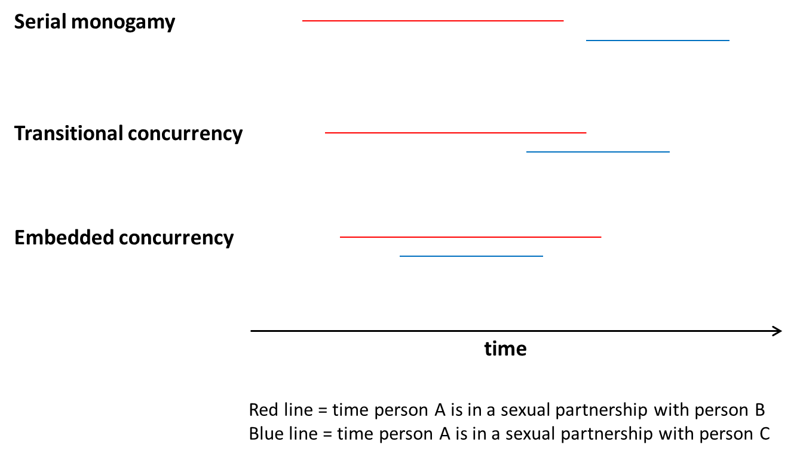

The concept of relational concurrency appears frequently in the literature on HIV epidemiology, and is believed by some researchers to represent a key factor in understanding large disparities in the prevalence of HIV or other sexually transmitted infections (STIs) among populations.  On the one hand, the basic logic behind the hypothesis is straightforward; on the other hand, it entails some subtleties that can run counter to many people’s intuition. Thus, it can be somewhat tricky to understand, which has caused some confusion among both researchers and the general public.

The aim of this website is to provide intuitive, easy-to-use tools to help researchers and the general public to understand the concept of relational concurrency and the ways in which it can affect the spread of sexually transmitted infections like HIV. The site contains some introductory overviews, followed by a series of four exercises.

The four exercises focus on relational concurrency at the local level and the population level; each level is first explored through a conceptual exercise, and then by a more complex numerical exercise.

The conceptual exercises do not require any special mathematical background, and are geared at providing a basic but powerful understanding of relational concurrency. Some readers may wish to explore only the conceptual exercises.  The numerical exercises require some additional background. Specifically, [Exercise 3](ex3-local-numerical.qmd) requires an ability to calculate basic probabilities. [Exercise 4](ex4-pop-numerical.qmd) requires familiarity with the R programming language. We thus provide a tutorial for each of these components. Readers may wish to try the exercises first, to see if they are able to follow them; if not, they can switch over to the tutorials.

Throughout the exercises, we will use the term “concurrency” as short-hand for “relational concurrency” or “sexual relationship concurrency.”  One may see all of these terms in the literature; they mean the same thing.

## What concurrency is (and is not)

**Relational concurrency** refers to the situation in which one individual is involved in **two or more relationships that overlap in time**.

Concurrency is **not** simply a synonym for multiple partnerships. The phrase “multiple partnerships” is typically used in HIV/STI epidemiology to refer the case of people having multiple sex partners over the course of some time period—for example, a year. Within this definition, each pair of multiple partners can be sequential (one ends before the next one begins; also called serial monogamy), or they can be concurrent.  In order for someone to have concurrent partnerships, they must have multiple partnerships (at least two); but the reverse is not necessarily true—one can have multiple partners without having concurrent partners.

In the following examples, let the red line represent the time that person A is in a sexual relationship with person B, and the blue line represent the time that person A is in a sexual relationship with person C. All three cases represent Person A having multiple (specifically two) partners.  But only in the latter two cases does Person A have concurrent partners.  Sometimes researchers distinguish between these two forms of concurrency by referring to them as “transitional concurrency” and “embedded concurrency”.

{width="500px"}

Having multiple sexual partners will typically increase the potential for a person to acquire or transmit an STI, when compared to the same person having just one partner.  This is true regardless of whether those multiple partners are sequential or concurrent.  But **the importance of concurrent partnerships is that they greatly increase the potential for an STI to spread, above and beyond multiple partnerships that are sequential**.  As we progress through the exercises on this website, we will explore how and why this is, and what the implications are.

## How concurrency works (and does not)

Probably the most important—and most misunderstood—aspect of concurrency is the question of who it puts at risk.  Most people are used to thinking about risk of disease for individuals, due to factors about that individual.  For example, we often think about how someone having a particular gene or eating a particular diet will increase that person’s risk of developing diabetes.  For infectious diseases, we do the same:  does attending day care affect a child’s risk of acquiring the flu? Does consuming alcohol before sex affect one’s risk of acquiring an STI?

The tricky thing about concurrency is that it doesn’t work the way we are used to thinking.  For instance, if a man has two partners concurrently, then he will have the exact same risk of acquiring an STI as if he had had those same two partners sequentially, all else being equal.  But he will have a higher chance of passing the infection on to one of his partners.  Thus, the person put at risk by concurrency is not the person with the concurrent partners, but his or her partners. The exercises that follow will demonstrate how and why concurrency works this way, and what the implications are.

One important thing we can already see is that this feature of concurrency thus makes it very difficult to actually detect concurrency at work in spreading STIs.  Most disease studies look at individual factors (behaviors, genes, etc.) as predictors of individual risk, for at least two reasons: (1) this matches how we are used to thinking about risk (see above); and (2) this is a relatively familiar and feasible way of designing a study of disease.

**However, if one collects data on the number and timing of people’s sexual relationships, and then compares those with concurrent partners to those without concurrent partners (controlling for cumulative number of partners over time), one will probably not find that those with concurrent partners are more likely to have or to acquire HIV or any another STI. But, this does not mean that concurrency is not increasing the spread of STIs; instead, it simply means that one is looking for the effect in the wrong person.**

The exercises on this website explain why this is so.

## What this tutorial is (and is not)

The body of literature on concurrency is large, and our goal is not to summarize all of it (although we do provide links to some of it in the [More Resources](resources.qmd) section). That literature has two major research paradigms within it:

* using mathematical models to demonstrate the potential impact of concurrency

* analyzing data to show that two or more populations that differ in prevalence or patterns of STIs also have corresponding differences in prevalence or patterns of concurrency

Some papers do both of these things together.  The methods to support each of these paradigms have developed over the years, starting off fairly simple and becoming more complex.  This tutorial _does not_ address the data side of the research at all.  And it _does not_ aim to reproduce all of the complexity of all of the concurrency models that have been built.

What this tutorial _does do_ is to explore the basic logic of concurrency to help readers who are not familiar with the modeling work to gain some intuition about concurrency and its impacts.  In order to make models realistic, they must become complex; and once they become complex, it is difficult for most people to understand them and follow their logic.  So this tutorial takes a different approach: make things simple, in order to provide an accessible introduction to how concurrency works and what its potential effects are.  Aided by the resulting insights, those who are interested can then explore the literature further.

By the end, then, readers should:

* be able to highlight the mechanisms by which concurrency does (and does not) work
* explain how concurrency can impact epidemic dynamics
* be able to read the concurrency literature more critically, and to assess whether study designs and analysis methods are appropriate for detecting concurrency effects.

## The four exercises

The exercises build in two directions at once: from the **local** level (a few people) to the **population** level (a whole network), and from **conceptual** reasoning to **numerical** calculation. Work through them in order, or jump to the track that interests you.

:::: {.roadmap-grid}

::: {.roadmap-card}
[**Exercise 1: The local level, conceptually**](ex1-local-conceptual.qmd)

Sequential Sam and concurrent Chris, matched on everything but timing, reveal why concurrency shifts risk onto a person's partners rather than the person themselves.
:::

::: {.roadmap-card}
[**Exercise 2: The population level, conceptually**](ex2-pop-conceptual.qmd)

A 24-person network shows how much farther an infection can travel when partnerships overlap instead of following one another.
:::

::: {.roadmap-card}
[**Exercise 3: The local level, numerically**](ex3-local-numerical.qmd)

The same Sam and Chris comparison, worked out with explicit per-act transmission probabilities and full derivations.
:::

::: {.roadmap-card}
[**Exercise 4: The population level, numerically**](ex4-pop-numerical.qmd)

A full dynamic-network HIV microsimulation you can run and modify, with a companion [interactive app](https://epimodel.github.io/concurrency.sim).
:::

::::

If you would like a refresher before the numerical exercises, see the [rules of probability](prob-tutorial.qmd) and the [introduction to R](r-tutorial.qmd) in the Background section.

## Authors and license

This tutorial was authored by [Steven M. Goodreau](http://faculty.washington.edu/goodreau/) (University of Washington), [Samuel M. Jenness](http://samueljenness.org/) (Emory University), and [Martina Morris](http://faculty.washington.edu/morrism) (University of Washington). It is part of the [EpiModel](https://www.epimodel.org/) ecosystem.

All material is covered by a [GPL-3.0 license](https://github.com/EpiModel/ConcurrencyTutorial?tab=GPL-3.0-1-ov-file). Code can be found in the associated [GitHub repository](https://github.com/EpiModel/ConcurrencyTutorial).
